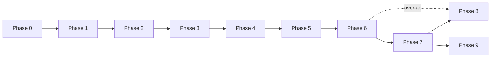
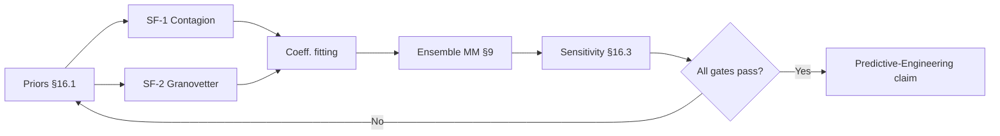

# Project: The Multidimensional Kinetic Mesh (MKM)

## Overview

**What this is.** MKM simulates a society as a four-layer graph (physical, emotional, economic, social) over a shared vertex set, with cross-layer bridge functions coupling the layers and a structural plasticity loop that rewires topology under stress. Target scale: $10^6$ vertices on a single workstation.

**Why it exists.** To find the *Mathematical Minimum* — the smallest initial allocation of trust and resources from which a population recovers after a given shock. The goal is not pretty collapse dynamics; it is a constructive floor on societal resilience (see Section 18).

**What success looks like.** A reproducible, deterministic pipeline that (a) recovers known resilience boundaries from the literature (percolation, contagion thresholds) as a calibration check, and (b) produces resilience heatmaps over parameter sweeps whose qualitative shape is stable across seed ensembles.

---

## Preamble — Glossary & Terminology

Consistent terminology is critical. Use these terms exactly as defined; do not introduce synonyms without updating this glossary.

* **Agent / Vertex / Node** — informally interchangeable, but in this document:
    * **Agent:** the conceptual entity being modeled (a person, actor, unit).
    * **Vertex:** the canonical simulation object representing an agent. One ECS entity with state in every layer.
    * **Node:** avoid — use "vertex."
* **Layer / Mesh / Plane** — informally interchangeable, but:
    * **Layer:** canonical. One of the four dimensions ($M_p$, $M_e$, $M_c$, $M_s$).
    * **Mesh:** reserved for the entire multi-layer structure as a whole.
* **Edge / Connection:** **Edge** is canonical. An edge belongs to exactly one layer and connects two vertices within that layer.
* **Pillar:** the vertical construct formed by a single vertex's projections across all layers. Shear is measured along the pillar.
* **Bridge Function ($B_{xy}$):** a transfer function between layers *within a single vertex*. Not to be confused with **The Weave** (edge creation event).
* **The Snap:** a single edge-pruning event.
* **The Weave:** a single edge-creation event. (Formerly called "The Bridge" — renamed to avoid collision with Bridge Function.)
* **The Shatter Point:** the global event where any layer's largest connected component falls below the critical fraction.
* **Tick:** one discrete simulation step. Advances `sim_time` by `dt`.
* **Zombie:** a vertex with zero active edges, retained in memory for possible re-entry.

---

## 1. Core Architecture: The Vertex & The Stack
The model treats a society or system as a **Temporal Adaptive Tensor** — a four-layer stack of graphs evolving in discrete time.

### The Vertex (Vertical Axis)
* **Identity:** one agent is one vertex, exposing state in every layer simultaneously. The vertex is the integrative unit.
* **Non-Uniformity:** a vertex's observable state differs per layer. A neighbor in $M_s$ sees reputation and trust; a neighbor in $M_p$ sees position.
* **Variable Mass:** `mass: f32` modulates how strongly the vertex resists bridge-function perturbations and how much its signal dominates its edges. Mass drifts slowly with accumulated influence.

### The Multidimensional Stack ($M_x$)
Four layers, each a distinct graph over the same vertex set:
* **$M_p$ (Physical):** position, kinetic energy, spatial logistics.
* **$M_e$ (Emotional):** valence, arousal, affective state.
* **$M_c$ (Economic):** resources, flow rate, scarcity.
* **$M_s$ (Social):** reputation, hierarchy rank, trust.

Layers are deliberately coarse. Adding a fifth layer is a breaking change — it requires extending every bridge function and the state schema.

**Why these four (and not five).** The layers were chosen so that (a) each has a well-studied empirical literature (percolation for $M_p$, contagion for $M_e$, flow networks for $M_c$, trust networks for $M_s$) usable for calibration, and (b) they are causally non-redundant — no layer can be derived from the others by a local rule. An *epistemic / informational* fifth layer (what agents believe, independent of how they feel) is the strongest candidate for addition but is intentionally omitted: belief formation is folded into `SocialState.trust` and `SocialState.reputation` in v1, on the premise that at the scale of interest the observable dynamics (who cooperates with whom) are what matter, not the internal knowledge state. A v2 with an explicit $M_i$ is a future extension (see Section 18, non-goals).

---

## 2. Dynamic Mechanics & Topology

### Pondered Edges
Edges are **active filters with memory**, not passive links.
* **Resistance:** `resistance: f32 ∈ [0, R_max]`. Attenuates signal strength. `conductance = 1 / (1 + resistance)`.
* **Weight:** `weight: f32 ∈ [-1, 1]`. Sign determines cooperative vs. antagonistic.
* **Hysteresis:** resistance is recomputed each tick as `resistance_{t+1} = α · resistance_t + (1 - α) · f(history)`. Path dependency is first-class.

### Kinetic Cascades (Bleed-through)
Horizontal propagation along edges happens per layer. Vertical propagation happens per vertex via **Bridge Functions** (Section 5 defines the full tick pipeline).

### Structural Plasticity (Evolutionary Topology)
* **Edge Pruning (The Snap):** triggered when `resistance > YIELD_POINT` or `resource_flow == 0` in $M_c$.
* **Edge Creation (The Weave):** triggered when a vertex enters **Tight Coupling** with fewer than `MIN_EDGES` active connections; candidates found via spatial (Quadtree) or trust-threshold lookup.
* **Node Latency (Zombies):** a vertex with zero edges does not vanish — it is flagged `Zombie` with a decayed snapshot, available for re-entry. Scalar state *and* mass decay by `ZOMBIE_DECAY` per tick while `Zombie`; position is frozen. On re-entry (a Weave targeting the Zombie), the decayed state is retained — the vertex does not "reset" to any default.

### Coupling States
* **Loose Coupling** (`level ∈ [0.0, 0.5)`): layers operate with high independence (normal/stable).
* **Tight Coupling** (`level ∈ [0.5, 1.0]`): layers lock; bridge-function outputs are amplified by the coupling factor (crisis/shock).

`coupling.level` is itself a feedback function of global stress metrics (see Crisis Metrics).

### Mass Dynamics
Mass drifts slowly with cumulative influence and throughput. Per tick, for vertex $V$:

$$\Delta m_{\text{raw}} = K_{\text{mass}} \cdot \left( \text{social\_influence}(V) + \text{economic\_throughput}(V) \right)$$

$$\Delta m = \text{clamp}(\Delta m_{\text{raw}}, -\text{MASS\_DELTA\_MAX}, +\text{MASS\_DELTA\_MAX})$$

where:
* $\text{social\_influence}(V) = \sum_{e \in \text{out}_s(V)} |e.\text{weight}|$ — sum of absolute weights of active outgoing $M_s$ edges.
* $\text{economic\_throughput}(V) = \overline{|\text{flow\_rate}|}$ over `HISTORY_WINDOW`.
* $K_{\text{mass}} = 0.001$ default — mass takes $\sim 10^3$ ticks of sustained influence to move by 1.0.

**Effect:** high-mass vertices resist bridge-function perturbations and dominate their edges' signal contribution. Mass is never reset; it only clamps and drifts within `MASS_DELTA_MAX` per tick in either direction. The damping factor $D(m) = 1 / (1 + K_{\text{mass\_damp}} \cdot (m - 1))$ applied to every bridge output is specified in Section 6 (**Bridge Functions**); the edge-propagation mass weighting $m / (1 + m)$ is specified in Section 5, Stage 2.

---

## 3. State Schema & Invariants

### Vertex Components
```
Vertex             { id: u64, mass: f32 ∈ [0, 10] }

PhysicalState      { position: Vec2, kinetic_energy: f32 ∈ [0, 1] }
EmotionalState     { valence: f32 ∈ [-1, 1], arousal: f32 ∈ [0, 1] }
EconomicState      { resources: f32 ∈ [0, 1], flow_rate: f32 ∈ [-1, 1] }
SocialState        { reputation: f32 ∈ [-1, 1], hierarchy_rank: u32, trust: f32 ∈ [0, 1] }

CouplingState      { level: f32 ∈ [0, 1], ema_state: f32 ∈ [0, 1] }
EnergyBudget       { current: f32 ∈ [0, capacity], capacity: f32, regen_rate: f32 }
LifecycleState     = Active | Strained | Zombie { decay_since: Tick }

Inbox {
    physical:  SmallVec<f32; 8>,
    emotional: SmallVec<f32; 8>,
    economic:  SmallVec<f32; 8>,
    social:    SmallVec<f32; 8>,
}
```

`Inbox` is a transient per-vertex scratch buffer populated by Stage 2 (edge signal propagation) and drained by Stage 3 (bridge cascade). Cleared at the end of Stage 3 every tick. `SmallVec` with inline capacity 8 avoids heap allocation in the common case (median degree < 8 per layer).

**EnergyBudget semantics:**
* `current` is non-negative and clamped to `[0, capacity]`.
* `regen_rate` adds to `current` each tick in Stage 5 before structural events fire.
* Structural events (Snap, Weave) deduct from `current`; if `current < event_cost`, the event is **deferred** (re-evaluated next tick).
* Default: `capacity = 1.0`, `regen_rate = 0.01`.

### Edge Components
```
Edge {
    source: Entity,
    target: Entity,
    layer: LayerKind,
    weight: f32 ∈ [-1, 1],
    resistance: f32 ∈ [0, R_max],
    history: RingBuffer<f32; HISTORY_WINDOW>,
    state: EdgeLifecycle = Active | Strained | Snapped,
}
```

### Invariants
All must hold at the end of every tick. Violations are assertion failures in debug builds and structured warnings in release.

1. **State bounds.** Every state value stays within its declared range. Out-of-range values are clamped and logged.
2. **Edge directionality.** `Edge(A → B)` and `Edge(B → A)` are distinct directed edges. Undirected relationships are modeled as a pair.
3. **Layer isolation.** An edge belongs to exactly one layer; cross-layer flow happens only via bridge functions.
4. **No dangling edges.** Every edge's `source` and `target` must reference a live (`Active` or `Zombie`) vertex.
5. **Energy bookkeeping.** Every per-vertex bridge-activity cost ($\sum_l |\delta_l \cdot A \cdot D(m)|$, see Section 5) and every structural plasticity event (Snap, Weave) must be deducted from `EnergyBudget` in the same tick. A tick cannot create free energy: if a vertex's cumulative deductions exceed `current + regen`, the offending event is deferred. Bridge outputs are *not* conservative across layers (an emotional spike can create kinetic energy); the invariant is accounting, not conservation.
6. **Mass monotonicity.** `|Δmass| ≤ MASS_DELTA_MAX` per tick.
7. **Determinism.** Given the same seed and config, a deterministic-mode run produces bit-identical outputs across invocations.

### Initial Conditions & Seeding

All randomness derives from the root `ChaCha20Rng` keyed on `seed`. The RNG is split deterministically for independent streams (positions, states, edges, per-vertex future draws).

**Vertex positions** (by `init_distribution`):
* `uniform` — `position ~ U(spatial_extent)` per axis.
* `clustered` — pick $K = \lceil \sqrt{n} \rceil$ centroids uniformly; each vertex samples from an isotropic Gaussian around its centroid with $\sigma = 0.05 \cdot \text{extent}$.
* `power_law` — positions via a Zipf-weighted mixture; $\sim 5\%$ of vertices carry disproportionate mass (exponent $s = 1.5$).

**Vertex scalar states** (uniform over valid range, unless `init_distribution = clustered`, in which case reputation and trust are correlated within a cluster via $\mathcal{N}(\mu_\text{cluster}, 0.1)$):
* `valence ~ U(-0.2, 0.2)` (low initial emotional charge).
* `arousal ~ U(0, 0.2)`.
* `resources ~ U(0.4, 0.6)`.
* `flow_rate = 0` at $t = 0$.
* `reputation ~ U(-0.1, 0.1)`, `hierarchy_rank = 0`, `trust ~ U(0.3, 0.7)`.
* `mass ~ \mathcal{N}(1.0, 0.2)` clamped to $[0.1, 10]$.
* `kinetic_energy = 0` at $t = 0$.

**Initial edges:** target count per layer is $\lfloor n_{\text{vertices}}^2 \cdot \text{edge\_density} \rfloor$ (default $0.005 \Rightarrow \sim 500\text{K}$ edges per layer at $10^4$ vertices). Per layer:
* $M_p$ — $k$-nearest spatial neighbors where $k$ satisfies target count.
* $M_s$ — random pairs with acceptance probability proportional to $1 - |\text{reputation}_A - \text{reputation}_B|$.
* $M_e$ — random pairs with acceptance proportional to $1 - |\text{valence}_A - \text{valence}_B|$.
* $M_c$ — random pairs with acceptance proportional to complementarity of `resources` (high + low pair preferred).

**Initial edge state:** `weight ~ U(-0.5, 0.5)` (scenarios can override sign bias), `resistance = 0.1`, `history = empty`, `state = Active`.

**Initial energy:** `current = capacity = 1.0` for all vertices.

**Initial coupling:** `level = 0.0`, `ema_state = 0.0`.

---

## 4. Crisis Metrics: Shear & Collapse
Two primary indicators of systemic failure, plus one global event.

### Vertex Shear ($S_\mu$)
* **Definition:** horizontal displacement between a vertex's representations across layers.
* **Formula:** $S_\mu = \frac{1}{\binom{|L|}{2}} \sum_{i < j} \| \hat{s}_i - \hat{s}_j \|_2$, where $\hat{s}_l$ is the vertex's state in layer $l$ projected into a common normalized embedding (default: linear per-layer normalization to $[0, 1]^n$).
* **Conditional Calculation:** only computed when `max_layer_delta > TENSION_THRESHOLD`. Below threshold, $S_\mu$ is assumed unchanged.
* **Consequence:** increases per-tick energy cost (`energy_cost += SHEAR_COST_FACTOR · S_μ`); feeds back into coupling.
* **Interpretation caveat:** $S_\mu$ mixes incommensurate quantities (position, trust, valence, flow) via ad-hoc $[0, 1]$ normalization. Treat it as a **relative** quantity — meaningful for trajectories within one run and for comparing runs at matched `init_distribution`, **not** as an absolute cross-scenario distance. A learned embedding is a v2 consideration (Section 17.1).

### Layer Collapse ($C_\mu$)
* **Definition:** rate of horizontal edge deletions within a specific layer.
* **Formula:** $C_\mu^{(l)} = \frac{|\text{snapped}(l, T)|}{|\text{active}(l, t_0)|}$ over rolling window $T$ (default `COLLAPSE_WINDOW = 64`).
* **Collapse Flag:** layer $l$ enters `Collapsed` when $C_\mu^{(l)} > \text{COLLAPSE\_THRESHOLD}$.

### The Shatter Point
* **Global event:** triggered when the largest connected component (LCC) in any layer falls below $\phi_c$ of total vertices (default `0.5`, tunable per Percolation Theory).
* **Post-Shatter:** simulation continues (to model aftermath) and the event is flagged in the output stream. Recovery via Weave events is possible but rare.

### Feedback Loop
$S_\mu$ and $C_\mu$ feed back into the global stress metric that drives `CouplingState.level`. This is the positive feedback loop that produces crisis escalation.

**Global stress formula:**

$$\text{stress}_t = w_s \cdot \overline{S_\mu} + w_c \cdot \max_l C_\mu^{(l)} + w_r \cdot (1 - \overline{\text{resources}})$$

with default weights $w_s = 0.4$, $w_c = 0.4$, $w_r = 0.2$. All three terms are in $[0, 1]$, so $\text{stress} \in [0, 1]$.

**Coupling update (logistic + EMA smoothing):**

$$\text{level}_\text{new} = \sigma\left( \text{STRESS\_GAIN} \cdot (\text{stress}_t - \text{STRESS\_MIDPOINT}) \right)$$

$$\text{level}_{t+1} = \beta \cdot \text{level}_t + (1 - \beta) \cdot \text{level}_\text{new}$$

where $\sigma(x) = 1 / (1 + e^{-x})$, $\text{STRESS\_GAIN} = 4.0$, $\text{STRESS\_MIDPOINT} = 0.5$, $\beta = 0.9$ (stored in `CouplingState.ema_state`).

**Amplification factor used by bridge functions:**

$$A = 1 + (\text{COUPLING\_AMPLIFICATION} - 1) \cdot \text{level}$$

At `level = 0.0`: $A = 1$ (no amplification). At `level = 1.0`: $A = \text{COUPLING\_AMPLIFICATION}$ (default 2.0).

---

## 5. Tick Execution Model

Every tick is a **strictly ordered pipeline**. Parallelism within a stage is allowed; cross-stage parallelism is not.

### Stage Order (per tick)
1. **Ingest events.** Drain `EventQueue`; apply `TensorImpact` to affected vertices.
2. **Edge signal propagation.** For each edge $E = (A \to B, l, w, r)$:
    * Extract scalar signal from source in layer $l$ (see **Per-Layer Signal Extractor** below).
    * Compute conductance: $g = 1 / (1 + r)$.
    * Output: $s_\text{out} = w \cdot g \cdot s_\text{in} \cdot (A.\text{mass} / (1 + A.\text{mass}))$ — mass weighting ensures high-mass sources dominate their edges.
    * Append $s_\text{out}$ to $B.\text{inbox}[l]$.
3. **Bridge function cascade.** For each vertex: aggregate inbox per layer ($\text{agg}_l = \sum B.\text{inbox}[l]$), apply intra-layer updates, then apply all bridge functions targeting each layer, sum deltas, clamp to valid ranges. Clear inbox at end of stage.
4. **Crisis metric update.** Recompute $S_\mu$ (conditionally), $C_\mu$ per layer, global LCC. Update `CouplingState`.
5. **Structural plasticity.** Regen energy budgets. Evaluate Snap, Weave, and Zombie transitions. Mutate the graph. Deduct event costs.
6. **History commit.** Append tick's signal magnitudes to edge history buffers. Recompute edge resistance via hysteresis rule.
7. **Output & logging.** Emit per-tick metrics; flush snapshots if scheduled.

### Per-Layer Signal Extractor
Each layer defines a canonical scalar signal for edge propagation:
* $M_p$: $s = \text{kinetic\_energy}$ (non-negative; represents physical disturbance radiating outward).
* $M_e$: $s = \text{arousal} \cdot \text{sign}(\text{valence})$ (signed emotional charge; negative = fear/anger, positive = joy/confidence).
* $M_c$: $s = \text{flow\_rate}$ (signed; represents resource flux direction).
* $M_s$: $s = \text{trust} \cdot \text{reputation}$ (signed; trust gates how much reputation translates to social pressure).

### Determinism
* **Single seed:** the simulation accepts a single `u64` seed; all RNG derives from a seeded `ChaCha20Rng`.
* **Parallel ordering:** within a stage, parallelism must use associative reductions. Non-associative operations (e.g., parallel float summation) introduce bit-level noise and require `parallelism = "parallel"` in config.
* **Reproducibility target:** two runs with the same seed and config must produce identical outputs under `parallelism = "deterministic"`.

### Time Model
* **Fixed `dt`:** each tick advances `sim_time += dt`. Default `dt = 1.0` (abstract units).
* **No variable-step integration.** Sub-tick resolution is out of scope.
* **Tick → wall-time mapping is intentionally unfixed.** One tick represents "one interaction round" of unspecified real-world duration. Decay rates, hysteresis windows, and mass drift are all defined per-tick, so they inherit whatever calendar time a tick ends up mapping to at calibration. Calibration fixes the mapping by matching one stylized fact's observed timescale (e.g. a financial-contagion propagation that completes in N hours) to a simulated tick count (see Section 16).

### Intra-Layer Updates

Applied first inside Stage 3, from the inbox aggregate $\text{agg}_l$. These are *not* bridge functions — they are per-layer dynamics on each vertex, executed before cross-layer bridges fire. Full bridge-function spec is in Section 6.

| Layer | Update |
|---|---|
| $M_p$ | $\Delta \text{kinetic} = K_{\text{KIN}} \cdot \text{agg}_p - \text{FRICTION} \cdot \text{kinetic}$ |
| $M_p$ | $\Delta \text{position} = \text{direction}(\text{agg}_p) \cdot \text{kinetic} \cdot dt$ |
| $M_e$ | $\Delta \text{valence} = K_{\text{VAL}} \cdot \text{agg}_e - \text{DECAY}_{\text{val}} \cdot \text{valence}$ |
| $M_e$ | $\Delta \text{arousal} = K_{\text{AR}} \cdot |\text{agg}_e| - \text{DECAY}_{\text{ar}} \cdot \text{arousal}$ |
| $M_c$ | $\Delta \text{flow\_rate} = K_{\text{FLOW}} \cdot \text{agg}_c - \text{DECAY}_{\text{flow}} \cdot \text{flow\_rate}$ |
| $M_c$ | $\Delta \text{resources} = \text{flow\_rate} \cdot dt$ |
| $M_s$ | $\Delta \text{trust} = K_{\text{TR}} \cdot \text{agg}_s - \text{DECAY}_{\text{tr}} \cdot (\text{trust} - 0.5)$ |
| $M_s$ | $\Delta \text{reputation} = K_{\text{REP}} \cdot \text{agg}_s$ |

Decay terms mean-revert states in the absence of signal. All outputs clamped to the ranges declared in Section 3.

---

## 6. Bridge Functions

> [!IMPORTANT]
> **Bridge functions are the model.** The simulation succeeds or fails based on the quality of the equations below — the ones that say exactly how emotional weight transforms into physical movement, how scarcity erodes trust, and so on. Every other piece is scaffolding. Make them first-class: swappable, testable, parameterized, and *calibrated* (Section 16).

### Mechanics

Each bridge function is a closure `fn(&VertexView, &Params, A) -> LayerDelta` keyed by `(source_layer, target_layer)`, registered in a `BridgeRegistry` at scenario load. Multiple bridges targeting the same layer are **summed** (not chained); chaining requires an explicit scenario override.

Applied in Stage 3 of the tick pipeline (Section 5), *after* intra-layer updates. Each bridge output is modulated by the coupling amplification $A$ (from the global coupling state; see Section 4) and by a per-vertex mass damping factor $D(m)$.

**Mass damping factor** (applied to every bridge output; drift rule for $m$ itself is in Section 2, **Mass Dynamics**):

$$D(m) = \frac{1}{1 + K_{\text{mass\_damp}} \cdot (m - 1)}$$

where $K_{\text{mass\_damp}} = 0.5$ default. At $m = 1.0$: $D = 1$. At $m = 5.0$: $D \approx 0.33$. High-mass vertices are stiffer under cross-layer perturbation.

### Default Set

Let $\delta_l$ denote the raw delta produced; applied as $\text{state}_l \mathrel{{+}{=}} \delta_l \cdot A \cdot D(m)$.

| Bridge | Trigger | Delta |
|---|---|---|
| $B_{ep}$ (E → P) | arousal spike | $\delta_{\text{kinetic}} = K_{EP} \cdot \text{arousal}$ |
| $B_{pe}$ (P → E) | physical shock | $\delta_{\text{arousal}} = K_{PE} \cdot \text{kinetic}$ |
| $B_{ec}$ (E → C) | fear (high arousal + negative valence) | $\delta_{\text{flow}} = -K_{EC} \cdot \text{arousal} \cdot \max(0, -\text{valence})$ |
| $B_{ce}$ (C → E) | scarcity / abundance | $\delta_{\text{valence}} = K_{CE} \cdot (\text{resources} - 0.5)$ |
| $B_{pc}$ (P → C) | displacement | $\delta_{\text{flow}} = -K_{PC} \cdot \text{kinetic}$ |
| $B_{se}$ (S → E) | reputation drop | $\delta_{\text{arousal}} = K_{SE} \cdot \max(0, \text{reputation}_{t-1} - \text{reputation}_t)$ |
| $B_{sc}$ (S → C) | trust gate | $\delta_{\text{flow}} = K_{SC} \cdot (\text{trust} - \text{TRUST\_THRESHOLD})$ |
| $B_{cs}$ (C → S) | flow-rate accumulation | $\delta_{\text{trust}} = K_{CS} \cdot \text{flow\_rate}$ |

Eight default bridges covering both directions of each adjacent layer pair, except the two noted below. Every bridge's $K$ constant is a calibration target (Section 16).

### Omitted Bridges (documented rationale)

* $B_{cp}$ (C → P): wealth does not directly cause kinetic motion — movement requires agent decisions, which this model does not represent. Omitted to avoid a free "money moves people" channel that would bias the Mathematical Minimum calculation. Scenarios modeling migration should register it explicitly.
* $B_{es}$ (E → S): emotional state affecting reputation is mediated by observable behaviour, which is out of scope. Sustained $M_e$ volatility feeds back to $M_s$ indirectly via $B_{ec} \to B_{cs}$ (fear → flow collapse → trust erosion), which is the realistic channel.

### Registering Custom Bridges

Scenarios may register additional bridges (including the two above, or e.g. a v2 $M_i$ epistemic layer's cross-bridges) by providing a closure and a $K$ constant through `BridgeRegistry::register()`. Custom bridges receive the same $A$ and $D(m)$ treatment as defaults.

### Energy Bookkeeping

Per-vertex **bridge activity cost** = $\sum_l |\delta_l \cdot A \cdot D(m)|$ across all bridges that fired this tick. This cost is deducted from `EnergyBudget.current` in Stage 5, implementing Invariant 5. A vertex that cannot afford its own bridge activity has the lowest-magnitude bridges suppressed until it can.

### Worked Example — One Vertex, One Tick

A fully-traced example to anchor the pipeline. Use it to verify you understand the ordering and the formulas before reading code.

**Setup (vertex $V$ at start of tick $t$):**
* `PhysicalState`: position $(50, 50)$, kinetic_energy $0.0$
* `EmotionalState`: valence $0.0$, arousal $0.0$
* `EconomicState`: resources $0.5$, flow_rate $0.0$
* `SocialState`: reputation $0.1$, trust $0.5$
* `mass` $= 1.0$, `CouplingState.level` $= 0.2$, `EnergyBudget.current` $= 1.0$
* One incoming $M_e$ edge from neighbour $N$: `weight = 0.5`, `resistance = 0.3`. $N$'s emotional state: valence $= -0.4$, arousal $= 0.7$, mass $= 1.0$.
* No `TensorImpact` events this tick.

**Stage 1 — Ingest.** Empty event queue. No state change.

**Stage 2 — Edge signal propagation.** For the $N \to V$ edge in $M_e$:
* Signal extractor: $s_\text{in} = \text{arousal}_N \cdot \text{sign}(\text{valence}_N) = 0.7 \cdot (-1) = -0.7$.
* Conductance: $g = 1 / (1 + 0.3) = 0.769$.
* Mass weighting: $m_N / (1 + m_N) = 0.5$.
* Output: $s_\text{out} = 0.5 \cdot 0.769 \cdot (-0.7) \cdot 0.5 = -0.1346$.
* Append to $V.\text{inbox}[M_e]$.

**Stage 3 — Bridge cascade.** Aggregate: $\text{agg}_e = -0.1346$.

*Intra-layer updates (applied first, per the table above):*
* $\Delta\text{valence} = K_{VAL} \cdot \text{agg}_e - \text{DECAY}_{val} \cdot \text{valence} = 0.5 \cdot (-0.1346) - 0 = -0.0673$.
* $\Delta\text{arousal} = K_{AR} \cdot |\text{agg}_e| - \text{DECAY}_{ar} \cdot \text{arousal} = 0.3 \cdot 0.1346 - 0 = +0.0404$.

After intra-updates: valence $= -0.0673$, arousal $= 0.0404$.

*Cross-layer bridges (applied next, with $A = 1 + (2.0 - 1) \cdot 0.2 = 1.2$ and $D(1.0) = 1.0$):*
* $B_{ep}$: raw $\delta_\text{kinetic} = K_{EP} \cdot \text{arousal} = 0.4 \cdot 0.0404 = 0.0162$; applied as $0.0162 \cdot 1.2 \cdot 1.0 = +0.0194$.
* $B_{ec}$: raw $\delta_\text{flow} = -K_{EC} \cdot \text{arousal} \cdot \max(0, -\text{valence}) = -0.3 \cdot 0.0404 \cdot 0.0673 = -0.000816$; applied as $-0.000816 \cdot 1.2 = -0.000979$.
* $B_{ce}$: $\delta_\text{valence} = K_{CE} \cdot (0.5 - 0.5) = 0$ — no effect (resources at midpoint).
* All other bridges have zero trigger.

After bridges, clamped to valid ranges:
* valence $= -0.0673$, arousal $= 0.0404$, kinetic $= 0.0194$, flow $= -0.000979$.

Bridge activity cost: $|0.0194| + |0.000979| = 0.0203$. Clear inbox.

**Stage 4 — Crisis metrics.** `max_layer_delta` ≈ $0.067$ (valence). Below `TENSION_THRESHOLD = 0.15`, so $S_\mu$ is **not recomputed** for $V$. No snaps this tick, so $C_\mu$ unchanged. Global stress stays low; `coupling.level` drifts via EMA toward a low target.

**Stage 5 — Structural plasticity.** Energy regen: `current = min(1.0 + 0.01, 1.0) = 1.0`. No snap (edge `resistance = 0.3 < 0.9`). No zombies. No Weave triggers (`active_edges ≥ MIN_EDGES`). Deduct bridge activity: `current -= BRIDGE_ACTIVITY_COST · 0.0203 = 0.000406`. Final `current = 0.9996`.

**Stage 6 — History commit.** Append $|s_\text{out}| = 0.1346$ to the $N \to V$ edge's ring buffer. New resistance: $0.8 \cdot 0.3 + 0.2 \cdot \overline{\text{history}} \approx 0.267$ (assuming prior steady state at $0.3$).

**Stage 7 — Output.** Emit the tick-level row (n_active_vertices, mean_shear, coupling_mean, etc.).

**What this example demonstrates:** (a) intra-layer updates always precede cross-layer bridges; (b) coupling amplifies bridge outputs but not intra-layer updates; (c) bridge activity is *non-conservative* across layers (emotion created kinetic energy) — Invariant 5 is accounting, not conservation; (d) hysteresis lets resistance move down as well as up when signal is moderate.

---

## 7. Theoretical Correlations
* **Multiplex Network Theory:** nodes existing across multiple interacting layers.
* **Actor-Network Theory (ANT):** properties inhere in relationships, not nodes — motivating **Pondered Edges**.
* **Statistical Mechanics:** Tight Coupling modeled as a **phase transition**; $S_\mu$ and $C_\mu$ act as order parameters.
* **Percolation Theory:** the Shatter Point corresponds to the critical edge-deletion fraction where LCC collapses.
* **Complex Adaptive Systems:** self-organization from bridge functions plus structural plasticity.

---

## 8. Simulation Scenarios & Resilience Logic

### Universal Event Injector
Events are specified as:
```
TensorImpact { physical: f32, emotional: f32, economic: f32, social: f32 }
```
Targets: single vertex, spatial region, layer-global, or mesh-global. Sequences supported for escalating crises. Multiple events in the same tick are applied in stable sort order (tick, insertion order).

### Scenario Presets
* **Economic Shock:** `Impact { economic: -0.8 }` mesh-global. Observe cascade into $M_s$ and $M_e$.
* **Social Fragmentation:** targeted edge pruning in $M_s$. Observe shear and potential shatter.
* **Crisis Escalation:** gradual tightening of coupling + sequential shocks. Locate the Shatter Point.
* **Mutual Aid Formation:** sustained $M_c$ stress without shatter; observe Weave events forming new $M_s$ edges.

### Resilience & Self-Correction
* **Edge Elasticity:** resilient meshes enter `Strained` (high resistance, still active) before snapping.
* **Vertex Decoupling:** a vertex can attenuate its $B_{ep}$ gain when $M_e$ volatility exceeds a threshold — a "lock" on physical response to emotional spikes.
* **Predictive Engineering (The Dark Side):** search over initial conditions to find the **Mathematical Minimum** of trust and resources needed for recovery from a given shock. Output: resilience heatmaps.

### Formal Definition: The Mathematical Minimum

Given a scenario $S$ (initial distribution + shock event sequence), a search axis $x$ (e.g. `initial_trust_mean`, `initial_resources_mean`, `edge_density`), and recovery parameters $(\theta_{\text{recovery}}, T_{\text{recovery}}, p)$:

$$
\text{MM}(S, x) \;=\; \arg\min_{x} \Big\{\; P\big(\,L_T / L_0 \;\geq\; \theta_{\text{recovery}} \,\big|\, S, x\big) \;\geq\; p \;\Big\}
$$

where:
* $L_0$ is the pre-shock largest-connected-component fraction in the target layer (default: $M_s$).
* $L_T$ is the same measurement $T_{\text{recovery}}$ ticks after the last shock in $S$.
* $\theta_{\text{recovery}} \in (0, 1]$ is the recovery threshold (default: 0.8 — "80% of pre-shock connectivity restored").
* $T_{\text{recovery}}$ is the recovery horizon in ticks (default: $5 \times$ shock duration, floor 500).
* $p$ is the required success probability across a seed ensemble (default: 0.9, measured over $N \geq 32$ seeds per point — see ensemble support in Section 13).

The `mkm-cli sweep` and `scenarios::find_minimum` helpers implement this as a monotone binary search on $x$, provided $x$ is monotone in $P(\text{recovery})$ (trust and resources are; `edge_density` is bimodal — use a grid sweep for non-monotone axes).

**Failure modes to flag in output:** (i) the entire search range fails to meet $p$ (no MM exists at these recovery params — widen the axis or loosen $\theta_{\text{recovery}}$); (ii) $P(\text{recovery})$ is non-monotone in $x$ (binary search invalid — fall back to grid); (iii) the ensemble's IQR at the boundary exceeds 20% of the median (MM is unstable — report the interval, not a point).

---

## 9. Implementation Strategy

### Design Philosophy
**Data-Oriented Design.** State is laid out for cache locality and SIMD friendliness. Behavior lives in systems that operate on contiguous arrays of state.

### Tech Stack
* **Language:** Rust (safety, zero-cost abstractions, predictable performance).
* **ECS:** Bevy.
    * Built-in scheduler, plugin architecture, and rendering pipeline.
    * `SystemSet` ordering maps naturally to the tick pipeline (Section 5).
    * Runs headless during early phases; rendering plugin activates later.
    * Legion was considered but rejected because it would require gluing in `wgpu` and a custom scheduler separately.
* **Parallelism:** Rayon for CPU-side reductions; Bevy's parallel system scheduling for non-conflicting systems.
* **GPU:** `wgpu` compute shaders (WGSL) for bulk edge and cascade math.
* **Math:** `glam` (chosen for Bevy integration over `nalgebra`).
* **Serialization:** `serde` + MessagePack for snapshots; CSV/Parquet for metric export.
* **RNG:** `rand` + `rand_chacha` (seeded, deterministic).

### Crate Workspace
Four crates under a root `Cargo.toml` workspace. Each listed file is created during its referenced phase (see Section 14).

#### `mkm-core` — types, math primitives, layer definitions, state schema (no behavior)
```
src/
  lib.rs                 # re-exports; no logic
  id.rs                  # VertexId (u64), EdgeId (u64), Tick (u64)
  layer.rs               # LayerKind enum, Projection trait, signal extractors
  state.rs               # PhysicalState, EmotionalState, EconomicState, SocialState
  vertex.rs              # Vertex component; mass clamp helpers
  edge.rs                # Edge struct, EdgeLifecycle, conductance()
  inbox.rs               # Inbox component (per-layer SmallVec<f32;8>)
  coupling.rs            # CouplingState; level/ema_state update helpers
  energy.rs              # EnergyBudget; regen, can_afford(), deduct()
  lifecycle.rs           # LifecycleState (Active | Strained | Zombie)
  ringbuffer.rs          # RingBuffer<T; N> for edge history
  params.rs              # Params struct mirroring Section 12; TOML derive
  invariants.rs          # check_* functions for Invariants 1-7
  math.rs                # sigmoid, clamp, lerp, projection helpers
  events.rs              # TensorImpact, EventTarget, EventQueue type
  snapshot.rs            # Serde wrappers; MessagePack encode/decode stubs
tests/
  serde_roundtrip.rs
  invariants_static.rs
```

#### `mkm-sim` — tick pipeline, systems, event injection
```
src/
  lib.rs                 # Bevy plugin registering all systems
  tick.rs                # SystemSet ordering for the 7 stages
  rng.rs                 # ChaCha20Rng resource; per-system fork helpers
  systems/
    ingest.rs            # Stage 1: drain events, apply TensorImpact
    propagate.rs         # Stage 2: edge signal extraction + inbox writes
    bridges.rs           # Stage 3: intra-layer + cross-layer; BridgeRegistry
    crisis.rs            # Stage 4: S_μ, C_μ, LCC, Shatter, coupling update
    plasticity.rs        # Stage 5: energy regen, Snap, Weave, Zombie
    history.rs           # Stage 6: ring-buffer append + resistance hysteresis
    output.rs            # Stage 7: per-tick metrics, snapshot flush
  bridge_registry.rs     # trait BridgeFn; default_bridges(); register()
  spatial/
    quadtree.rs          # 2D spatial index for M_p neighbor queries
    octree.rs             # 3D fallback for sheared vertices
    index.rs             # SpatialIndex trait; per-tick rebuild
  metrics.rs             # running aggregates, EMA windows
  scenarios.rs           # preset definitions loaded by name
  init.rs                # initial vertex/edge sampling per Section 3.B
tests/
  tick_order.rs
  bridges_numeric.rs
  determinism.rs
  plasticity.rs
benches/
  edges_10k.rs
  full_tick_100k.rs
```

#### `mkm-viz` — Bevy rendering plugin (deferred; stubbed until Phase 8)
```
src/
  lib.rs                 # VizPlugin; no-op until Phase 8
  render/
    vertices.rs          # sphere/point primitives per vertex, per layer
    edges.rs             # line primitives; color/thickness mapping
    pillars.rs           # vertical connectors across layer Z-offsets
  views/
    top_down.rs          # XY camera, layer isolation
    profile.rs           # XZ camera, pillar stress visualization
  throttle.rs            # LOD switch: mesh → point cloud in collapsed zones
  overlay.rs             # HUD with shear/coupling/LCC readouts
```

#### `mkm-cli` — headless runner, scenario loader, data export
```
src/
  main.rs                # clap-based arg parsing; dispatches to commands
  commands/
    run.rs               # mkm-cli run <config.toml>
    replay.rs            # mkm-cli replay <snapshot>
    scenario.rs          # mkm-cli scenario <preset>
    sweep.rs             # mkm-cli sweep <config> --param ... --range ...
    inspect.rs           # mkm-cli inspect <snapshot>
  config.rs              # TOML parse → Params + scenario spec
  export/
    parquet.rs           # per-tick metrics writer
    jsonl.rs             # event-log writer
    msgpack.rs           # snapshot writer (via mkm-core::snapshot)
  report.rs              # summary stats printing for `inspect`
```

#### Workspace root
```
Cargo.toml               # workspace members, shared profile settings
rust-toolchain.toml      # pinned stable toolchain
.github/workflows/ci.yml # fmt, clippy, test, bench-smoke
README.md                # build & run
docs/                    # this file lives here as core.md
```

---

## 10. 3D Visualization Strategy
* **Volumetric Stacking:** each layer rendered at a fixed Z-offset. Vertices appear as points/spheres at their per-layer XY position.
* **Pillars:** vertical lines connecting a vertex's four layer projections. Healthy → perfectly vertical; stressed → diagonal, with color mapped to $S_\mu$ magnitude.
* **Edge Rendering:** thickness ∝ weight; color ∝ resistance (green → yellow → red → snapped). Strained edges pulse.
* **Diagnostic Views:**
    * **Top-down (XY):** clustering and edge-density per layer. Layer selector to isolate one plane.
    * **Profile (XZ):** detection of **Tight Coupling** (aligned oscillations) and **Shear** (bent pillars).
* **Crisis Throttling:** collapsed zones render as point-cloud primitives instead of mesh geometry to preserve frame rate.

---

## 11. Hardware-Specific Optimization
* **CPU (16 threads):** non-linear vertex logic, structural plasticity, coupling transitions.
* **GPU (8GB VRAM):** edge weight updates, cascade propagation, batch shear math.
* **Memory budget:**
    * ~32GB RAM reserved for edge history buffers at $10^6$ nodes with 64-tick windows.
    * VRAM at $10^6$ nodes: ~256MB vertex state + ~1.6GB edges (avg degree 50) + headroom for render.
* **Crisis Throttling:** LOD degradation (point clouds) in collapsed zones preserves frame rate during high-entropy events.
* **2D vs. 3D partitioning:** Quadtrees in normal state; Octree fallback activated per-vertex only when $S_\mu$ exceeds threshold.

---

## 12. Parameter Reference

Every tunable in one place. Defaults shown; scenarios may override via config.

**Naming conventions:**
* `UPPER_CASE` — thresholds, window sizes, and physical-meaning constants (e.g. `YIELD_POINT`, `COLLAPSE_WINDOW`, `TRUST_THRESHOLD`). Interpret these as *structural limits*; they are unlikely to move during calibration.
* `K_xx` — gain constants on specific bridge or intra-layer updates (e.g. `K_EP`, `K_VAL`). These are the **primary calibration targets** (see Section 16).
* Greek letters (`α`, `β`, `φ_c`) — ratios, smoothing factors, or critical fractions from the literature. Bounded in $[0, 1]$ except where noted.

| Parameter | Default | Range | Meaning |
|---|---|---|---|
| `dt` | 1.0 | (0, ∞) | Tick duration (abstract units) |
| `HISTORY_WINDOW` | 64 | [1, 512] | Edge ring-buffer size (ticks) |
| `R_max` | 1.0 | (0, ∞) | Maximum edge resistance |
| `YIELD_POINT` | 0.9 | (0, R_max] | Resistance at which an edge snaps |
| `α_resistance` | 0.8 | [0, 1] | Resistance smoothing factor (hysteresis) |
| `TENSION_THRESHOLD` | 0.15 | (0, 1] | Max-layer-delta above which shear is computed |
| `SHEAR_COST_FACTOR` | 0.1 | [0, ∞) | Per-tick energy cost multiplier for shear |
| `COLLAPSE_THRESHOLD` | 0.4 | (0, 1] | $C_\mu$ fraction flagging layer collapse |
| `COLLAPSE_WINDOW` | 64 | [1, 1024] | Tick window over which $C_\mu$ is measured |
| `φ_c` | 0.5 | (0, 1) | LCC fraction below which Shatter fires |
| `MIN_EDGES` | 3 | [0, ∞) | Min active edges before Weave search runs |
| `BASE_COST` | 0.05 | [0, 1] | Baseline energy cost of edge creation |
| `PHYSICAL_MULTIPLIER` | 3.0 | [1, ∞) | Extra cost for creating $M_p$ edges |
| `COUPLING_AMPLIFICATION` | 2.0 | [1, ∞) | Bridge-function gain at `level = 1.0` |
| `MASS_DELTA_MAX` | 0.01 | (0, 1] | Max per-tick mass change |
| `ZOMBIE_DECAY` | 0.99 | (0, 1] | Per-tick state decay factor for Zombies |
| `ENERGY_CAPACITY` | 1.0 | (0, ∞) | Default per-vertex energy capacity |
| `ENERGY_REGEN_RATE` | 0.01 | [0, 1] | Per-tick energy regeneration |
| `BRIDGE_ACTIVITY_COST` | 0.02 | [0, 1] | Cost multiplier for total bridge delta magnitude |
| `K_mass` | 0.001 | [0, 1] | Mass drift gain from influence + throughput |
| `K_mass_damp` | 0.5 | [0, ∞) | Mass damping coefficient in bridge output |
| `STRESS_GAIN` | 4.0 | (0, ∞) | Logistic steepness for coupling update |
| `STRESS_MIDPOINT` | 0.5 | [0, 1] | Stress value at which coupling = 0.5 |
| `STRESS_EMA_β` | 0.9 | [0, 1] | EMA smoothing factor for coupling.level |
| `w_shear` | 0.4 | [0, 1] | Stress weight on mean shear |
| `w_collapse` | 0.4 | [0, 1] | Stress weight on max layer collapse rate |
| `w_resources` | 0.2 | [0, 1] | Stress weight on resource deficit (1 - mean resources) |
| `FRICTION` | 0.1 | [0, 1] | Per-tick kinetic energy decay |
| `DECAY_val` | 0.05 | [0, 1] | Valence mean-reversion rate |
| `DECAY_ar` | 0.1 | [0, 1] | Arousal decay rate |
| `DECAY_flow` | 0.1 | [0, 1] | Flow-rate decay rate |
| `DECAY_tr` | 0.02 | [0, 1] | Trust mean-reversion rate (toward 0.5) |
| `K_KIN` | 0.5 | [0, ∞) | Intra-layer $M_p$ inbox gain |
| `K_VAL` | 0.5 | [0, ∞) | Intra-layer valence inbox gain |
| `K_AR` | 0.3 | [0, ∞) | Intra-layer arousal inbox gain |
| `K_FLOW` | 0.5 | [0, ∞) | Intra-layer flow-rate inbox gain |
| `K_TR` | 0.2 | [0, ∞) | Intra-layer trust inbox gain |
| `K_REP` | 0.3 | [0, ∞) | Intra-layer reputation inbox gain |
| `K_EP` | 0.4 | [0, ∞) | $B_{ep}$ gain (Emotion → Physical) |
| `K_PE` | 0.2 | [0, ∞) | $B_{pe}$ gain (Physical → Emotional) |
| `K_EC` | 0.3 | [0, ∞) | $B_{ec}$ gain (Emotion → Economic; fear) |
| `K_CE` | 0.3 | [0, ∞) | $B_{ce}$ gain (Economic → Emotional; scarcity/abundance) |
| `K_PC` | 0.2 | [0, ∞) | $B_{pc}$ gain (Physical → Economic) |
| `K_SE` | 0.5 | [0, ∞) | $B_{se}$ gain (Social → Emotional) |
| `K_SC` | 0.3 | [0, ∞) | $B_{sc}$ gain (Social → Economic) |
| `K_CS` | 0.2 | [0, ∞) | $B_{cs}$ gain (Economic → Social; flow → trust) |
| `TRUST_THRESHOLD` | 0.4 | [0, 1] | Trust floor below which $B_{sc}$ becomes inhibitive |

---

## 13. Configuration, CLI & Data Output

### Configuration Format (TOML)
```toml
[simulation]
seed          = 42
dt            = 1.0
max_ticks     = 10_000
parallelism   = "deterministic"   # or "parallel"

[initial_conditions]
n_vertices        = 10_000
edge_density      = 0.005
spatial_extent    = [0.0, 100.0]
init_distribution = "uniform"     # "uniform" | "clustered" | "power_law"

[parameters]
# Any override from Section 12
yield_point    = 0.9
history_window = 64

[[events]]
tick   = 500
kind   = "TensorImpact"
target = { scope = "global" }
impact = { physical = 0.0, emotional = 0.3, economic = -0.8, social = 0.0 }

[output]
metrics_path      = "out/metrics.parquet"
snapshot_path     = "out/snapshots/"
snapshot_interval = 100
log_level         = "info"
```

### CLI Specification (`mkm-cli`)
* `mkm-cli run <config.toml>` — headless simulation run.
* `mkm-cli replay <snapshot>` — resume from snapshot.
* `mkm-cli scenario <preset>` — run a named preset.
* `mkm-cli sweep <config.toml> --param <name> --range <lo>..<hi>:<step> [--seeds <N>]` — parameter sweep for resilience analysis. With `--seeds N` (default 32), each parameter point is run $N$ times with distinct seeds derived from the base seed; output includes per-point median and IQR for every metric. Single-seed results are not acceptable for Predictive Engineering claims.
* `mkm-cli inspect <snapshot>` — print summary stats and invariant checks.

### Output Schema
* **Per-tick metrics (Parquet columns):** `tick`, `sim_time`, `n_active_vertices`, `n_zombies`, `n_edges_per_layer[4]`, `mean_shear`, `max_shear`, `c_mu_per_layer[4]`, `coupling_mean`, `lcc_per_layer[4]`, `shatter_flag`.
* **Event log (JSONL):** one line per Snap / Weave / Zombie / Re-entry / Shatter event with `tick`, vertex/edge IDs, and relevant state.
* **Snapshots (MessagePack):** full mesh state at configurable intervals — used for replay, debugging, and resilience analysis.

---

## 14. Implementation Roadmap

Each phase has a goal, concrete deliverables, and **acceptance criteria** — measurable conditions for phase completion.

### Phase 0 — Project Scaffolding
**Goal:** a compilable Rust workspace with the right structure and dependencies.

**Files created:**
- `Cargo.toml` (workspace), `rust-toolchain.toml`, `.gitignore`, `README.md`
- `mkm-core/Cargo.toml`, `mkm-core/src/lib.rs` (empty re-export stub)
- `mkm-sim/Cargo.toml`, `mkm-sim/src/lib.rs` (Bevy plugin skeleton)
- `mkm-viz/Cargo.toml`, `mkm-viz/src/lib.rs` (no-op plugin)
- `mkm-cli/Cargo.toml`, `mkm-cli/src/main.rs` (hello-world clap stub)
- `.github/workflows/ci.yml`

**Tasks:**
- [ ] Initialize git repository with `main` branch.
- [ ] Create workspace `Cargo.toml` listing all four member crates.
- [ ] Pin toolchain in `rust-toolchain.toml` (stable, latest).
- [ ] Add dependencies at workspace level: `bevy = "=0.14.2"`, `rand = "0.8"`, `rand_chacha = "0.3"`, `glam = "0.27"`, `serde = { version = "1", features = ["derive"] }`, `serde_json`, `toml`, `rmp-serde`, `smallvec`, `clap`, `parquet`, `arrow`. **Pin Bevy to an exact patch** (`=0.14.x`) — Bevy's 0.x minor releases break aggressively (ECS scheduling, plugin APIs, render graph). Unpinned `"0.14"` ranges silently pull in breaking changes; bump deliberately with a migration note in `CHANGELOG.md`.
- [ ] Configure `[profile.release]` with `lto = "thin"`, `codegen-units = 1`.
- [ ] Add CI workflow: matrix on `ubuntu-latest` running `cargo fmt --check`, `cargo clippy --all-targets -- -D warnings`, `cargo test --workspace`.
- [ ] Write `README.md`: prerequisites, `cargo run -p mkm-cli -- --help`, link to `docs/core.md`.
- [ ] Add `.editorconfig` and a minimal `rustfmt.toml`.

**Acceptance:**
- [ ] `cargo build --workspace` succeeds on a clean clone.
- [ ] `cargo test --workspace` passes (empty).
- [ ] CI green on initial commit.
- [ ] `mkm-cli --help` prints usage.
- [ ] `README.md` build/run instructions verified from a clean checkout.

---

### Phase 1 — Core Data Model & Tick Loop
**Goal:** spawn vertices with multi-layer state and step through time with no dynamics yet.

**Depends on:** Phase 0.

**Files created:**
- `mkm-core/src/{id,layer,state,vertex,edge,inbox,coupling,energy,lifecycle,ringbuffer,params,math,events,snapshot,invariants}.rs`
- `mkm-core/tests/serde_roundtrip.rs`, `mkm-core/tests/invariants_static.rs`
- `mkm-sim/src/{tick,rng,init,scenarios}.rs`
- `mkm-sim/src/systems/{ingest,output}.rs` (stubs for others)
- `mkm-sim/tests/determinism.rs`
- `mkm-cli/src/config.rs`, `mkm-cli/src/commands/run.rs`

**Tasks:**
- [ ] `mkm-core`: define every struct/enum in Section 3 with `#[derive(Clone, Debug, Serialize, Deserialize, PartialEq)]`.
- [ ] `layer.rs`: `enum LayerKind { Physical, Emotional, Economic, Social }`; `fn all() -> &'static [LayerKind; 4]`; `signal_extractor(layer, state) -> f32`.
- [ ] `ringbuffer.rs`: fixed-capacity ring buffer with const generic `N`; `push`, `iter`, `len`, `mean`, `sum_abs`.
- [ ] `params.rs`: `struct Params { ... }` with all Section 12 entries; `Default` impl with listed defaults; `from_toml(Path) -> Result<Params>`.
- [ ] `invariants.rs`: one function per invariant; `check_all(world, params) -> Vec<InvariantViolation>`.
- [ ] `events.rs`: `TensorImpact`, `EventTarget` (`Single | Region | Layer | Global`), `EventQueue` resource with stable-ordered push.
- [ ] `mkm-sim/tick.rs`: define `SystemSet`s for Stages 1–7; register in `FixedUpdate` with explicit `.chain()` ordering.
- [ ] `rng.rs`: `struct RngResource(ChaCha20Rng)`; `fork(label: &str) -> ChaCha20Rng` splits deterministically.
- [ ] `init.rs`: implement the three `init_distribution` modes from Section 3.B; seed from `Params.seed`.
- [ ] `systems/ingest.rs`: drain `EventQueue`, apply `TensorImpact` as `state += impact` clamped.
- [ ] `systems/output.rs`: emit per-tick summary (count, sim_time) to stdout; write snapshot at `snapshot_interval`.
- [ ] `mkm-cli/commands/run.rs`: load TOML → build Bevy app → run for `max_ticks` → exit.
- [ ] Add `cargo bench` smoke benchmark: full tick at 10K vertices with no dynamics.

**Acceptance:**
- [ ] 10 000 vertices spawned with randomized initial state matching Section 3.B.
- [ ] `sim_time` advances by exactly `dt` each tick (exact `f32` equality under fixed `dt = 1.0`).
- [ ] Snapshot round-trip preserves all state bit-for-bit (`assert_eq!(before, after)`).
- [ ] Same seed → identical SHA-256 hash of final snapshot across 3 back-to-back runs.
- [ ] Tick rate ≥ 1000/s at 10K vertices (no-dynamics baseline) on **reference CPU**.

> [!NOTE]
> **Reference hardware.** Throughput targets in this doc quote a **reference CPU** and **reference GPU**; the canonical baseline is recorded in `benches/hardware.toml` (currently: `cpu = "AMD Ryzen 7 5700X"`, `gpu = "AMD Radeon RX 7600"`). When benchmarks are run on different hardware, normalize results against the committed baseline rather than editing the acceptance numbers — targets remain meaningful across machines that way.
- [ ] All Invariants 1, 2, 3, 7 hold at every tick under an empty dynamics set.

---

### Phase 2 — Edge Mechanics (Pondered Edges)
**Goal:** edges filter and transform signals; history matters.

**Depends on:** Phase 1.

**Files created/modified:**
- `mkm-sim/src/systems/propagate.rs` (new)
- `mkm-sim/src/systems/history.rs` (new)
- `mkm-core/src/edge.rs` (expand: `conductance()`, `category()`, hysteresis helper)
- `mkm-sim/tests/propagate_numeric.rs` (new)
- `mkm-sim/tests/hysteresis.rs` (new)
- `mkm-sim/benches/edges_100k.rs` (new)

**Tasks:**
- [ ] `propagate.rs`: iterate edges, extract source signal via `layer::signal_extractor`, compute $s_\text{out} = w \cdot g \cdot s_\text{in} \cdot (m / (1 + m))$, push to target's `Inbox` layer bucket.
- [ ] `propagate.rs`: inbox buckets pre-sized; allocation-free fast path using `SmallVec` inline capacity 8.
- [ ] `history.rs`: append `|signal|` to each edge's `RingBuffer<f32; HISTORY_WINDOW>` at Stage 6.
- [ ] `history.rs`: compute `f(history) = ring.mean()`; apply `resistance_{t+1} = α · resistance_t + (1-α) · f(history)` with `α = α_resistance`.
- [ ] `edge.rs::category()`: return `Thick | Thin | Brittle` from `|weight|` × `resistance`; used for diagnostics only.
- [ ] Add `EdgeLifecycle::Strained` trigger: when `resistance > 0.7 · YIELD_POINT`.
- [ ] Integration test: two-vertex chain under constant signal; assert convergence.
- [ ] Integration test: alternating ± signal; assert asymmetric resistance growth vs. steady-state.
- [ ] Benchmark: 100K edges, single-threaded, measure ticks/sec.

**Acceptance:**
- [ ] Two-vertex constant-signal test: resistance converges to analytic value within 1% in ≤ HISTORY_WINDOW ticks.
- [ ] Alternating-signal test: hysteresis produces asymmetric resistance trajectory measurable at $10^{-3}$.
- [ ] 100K edges, single-threaded: ≥ 100 ticks/s on **reference CPU**.
- [ ] Invariants 1–4 hold across a 10K-tick fuzz run with random `TensorImpact` at 1% of ticks.
- [ ] Inbox is empty at start of every Stage 4 (verified via system ordering test).

---

### Phase 3 — Kinetic Cascades & Bridge Functions
**Goal:** cross-layer bleed-through via bridge functions. **The single most critical phase** — the quality of the whole model hinges on these equations.

**Depends on:** Phase 2.

**Files created/modified:**
- `mkm-sim/src/bridge_registry.rs` (new)
- `mkm-sim/src/systems/bridges.rs` (new)
- `mkm-core/src/energy.rs` (expand: `deduct()`, `regen()`, `can_afford()`)
- `mkm-sim/tests/bridges_numeric.rs` (new)
- `mkm-sim/tests/energy_bookkeeping.rs` (new)
- `mkm-sim/tests/mass_damping.rs` (new)

**Tasks:**
- [ ] `bridge_registry.rs`: define `trait BridgeFn: Send + Sync { fn apply(&self, view: &VertexView, params: &Params, amp: f32) -> LayerDelta; }`.
- [ ] `BridgeRegistry` stores `HashMap<(LayerKind, LayerKind), Box<dyn BridgeFn>>`; `default_set()` registers the eight from Section 6.
- [ ] `systems/bridges.rs`: for each vertex (parallel-safe), compute `agg_l = inbox[l].sum()`, apply intra-layer updates, then iterate registered bridges, sum per-layer deltas, apply `A * D(m)`, clamp, write back.
- [ ] Clear `Inbox` at end of Stage 3.
- [ ] Compute `bridge_activity = Σ|δ·A·D|` per vertex; pass to `energy.rs::deduct(BRIDGE_ACTIVITY_COST · bridge_activity)`.
- [ ] Per-layer clamping centralised in `state.rs::clamp_all()` for reuse.
- [ ] Unit test per bridge: hand-compute expected delta at fixed state, assert within `1e-6`.
- [ ] Integration test: emotional spike → proportional $M_p$, $M_c$ change within 3 ticks, values match analytic prediction within 5%.
- [ ] Integration test: set `coupling.level = 1.0` and identical state; verify output = `COUPLING_AMPLIFICATION × output_at_level_0`.
- [ ] Mass damping test: two vertices, identical state except `mass ∈ {1.0, 5.0}`; output ratio matches $D(1)/D(5)$.
- [ ] Custom scenario test: register a `B_ce` closure at runtime and verify it fires.

**Acceptance:**
- [ ] Emotional spike injection → proportional change in $M_p$ and $M_c$ within 3 ticks (analytic match within 5%).
- [ ] Tight coupling (`level = 1.0`) amplifies bridge outputs by exactly `COUPLING_AMPLIFICATION` at `mass = 1.0`.
- [ ] Energy bookkeeping (Invariant 5) holds per vertex per tick within $10^{-5}$ tolerance.
- [ ] Mass damping verified: `D(m)` matches formula within `1e-6` across $m \in [0.1, 10]$.
- [ ] Scenario config can register custom bridge functions without recompile (via dynamic dispatch).
- [ ] Invariants 1–5 hold across 10K-tick fuzz run with random shocks every 100 ticks.

---

### Phase 4 — Structural Plasticity
**Goal:** the mesh topology evolves.

**Depends on:** Phase 3.

**Files created/modified:**
- `mkm-sim/src/systems/plasticity.rs` (new)
- `mkm-sim/src/spatial/{quadtree,index}.rs` (new; octree stubbed)
- `mkm-sim/src/systems/output.rs` (expand: event-log JSONL writer)
- `mkm-sim/tests/plasticity.rs` (new)
- `mkm-sim/tests/zombie_reentry.rs` (new)

**Tasks:**
- [ ] `plasticity.rs`: Stage 5 order is **regen → Snap → Zombie-check → Weave → cost-deduct**.
- [ ] Snap trigger: `resistance > YIELD_POINT` OR (layer == Economic AND `signal_recent ≈ 0` for ≥ HISTORY_WINDOW/2 ticks).
- [ ] Before Snap, edges pass through `Strained` for at least 1 tick (elasticity).
- [ ] Zombie transition: vertex with 0 active edges for ≥ 1 tick → `LifecycleState::Zombie { decay_since: tick }`.
- [ ] Zombie per-tick decay: `state_l *= ZOMBIE_DECAY` applied to all scalar fields; position frozen.
- [ ] `spatial/quadtree.rs`: rebuild once per tick over active vertex positions; `query_radius(p, r) -> Vec<VertexId>`.
- [ ] Weave search: when vertex enters Tight Coupling with fewer than `MIN_EDGES` active edges, find candidates via quadtree (for $M_p$) or by scanning top-N by `trust` (for $M_s$).
- [ ] Weave cost: `BASE_COST × (PHYSICAL_MULTIPLIER if layer == Mp else 1.0)`. If `EnergyBudget.current < cost`, defer.
- [ ] Re-entry: a new edge to a Zombie restores `LifecycleState::Active` with already-decayed state retained.
- [ ] Event-log: append one JSON line per Snap / Weave / Zombie / Re-entry / Shatter to `snapshot_path/events.jsonl`.
- [ ] Test: seed one edge with `resistance = 0.95` → Strained → Snap within 2 ticks.
- [ ] Test: disconnect a vertex → Zombie in 1 tick → verify `ZOMBIE_DECAY` applied each tick.
- [ ] Test: new edge to Zombie → `Active` with post-decay state.
- [ ] Test: force `coupling.level = 1.0` in a cluster of 100 vertices → Weave event count > baseline by 3×.

**Acceptance:**
- [ ] Resistance past `YIELD_POINT` → Strained → Snap within 2 ticks.
- [ ] Isolated vertex → Zombie within 1 tick; scalar state decays by `ZOMBIE_DECAY` per tick.
- [ ] New edge to Zombie → reactivation with decayed state applied.
- [ ] Tight-coupling cluster shows ≥ 3× Weave events vs. loose-coupling baseline.
- [ ] Invariant 4 (no dangling edges) holds across 10K ticks of random perturbation with snap/bridge churn.
- [ ] Deferred events correctly retry when energy recovers (no starvation beyond 100 ticks).
- [ ] Event log parses cleanly (JSONL validator on output).

---

### Phase 5 — Crisis Metrics
**Goal:** quantitative stress diagnostics.

**Depends on:** Phase 4.

**Files created/modified:**
- `mkm-sim/src/systems/crisis.rs` (new)
- `mkm-sim/src/metrics.rs` (new)
- `mkm-sim/tests/shear.rs`, `mkm-sim/tests/collapse.rs`, `mkm-sim/tests/percolation.rs` (new)
- `mkm-core/src/coupling.rs` (expand: `update(stress, params)`)

**Tasks:**
- [ ] `crisis.rs::compute_shear(vertex)`: implement per-layer normalization to $[0,1]^n$; compute L2 pairwise distances; average over $\binom{4}{2} = 6$ pairs.
- [ ] Conditional calculation: track `max_layer_delta` per vertex; only recompute $S_\mu$ if above `TENSION_THRESHOLD`.
- [ ] `metrics.rs`: rolling-window `CollapseCounter<N=COLLAPSE_WINDOW>` per layer; `c_mu() = snapped_in_window / active_at_window_start`.
- [ ] LCC computation: union-find over each layer's edges at tick end; record largest-component fraction.
- [ ] Shatter detection: set `shatter_flag = true` for first tick where any layer's LCC fraction < `φ_c`; event-logged.
- [ ] `coupling::update`: apply the stress formula and EMA from Section 4; write to `CouplingState`.
- [ ] Integrate metric outputs into per-tick Parquet row.
- [ ] Test: create a vertex with hand-chosen per-layer state; verify $S_\mu$ matches hand computation to $10^{-4}$.
- [ ] Test: bulk-delete 50% of $M_s$ edges over 100 ticks; verify collapse flag fires when $C_\mu > $ threshold.
- [ ] Percolation test: delete edges uniformly at random in $M_p$; record the deletion fraction at which Shatter fires; average over 10 seeds; expect $\phi_c \approx 0.5 \pm 0.05$ (Erdős–Rényi tolerance).
- [ ] Feedback loop integration test: inject shock → shear grows → coupling rises → next-tick bridge outputs amplified.

**Acceptance:**
- [ ] Hand-computed $S_\mu$ matches implementation within $10^{-4}$ for 5 manual test cases.
- [ ] $C_\mu$ triggers collapse flag at threshold in synthetic edge-deletion test.
- [ ] Percolation: Shatter fires at $\phi_c = 0.5 \pm 0.05$ averaged across 10 seeds.
- [ ] Feedback loop demonstrable end-to-end on a 1000-tick shock scenario.
- [ ] Invariants 1–7 hold across all crisis-metric tests.

---

### Phase 6 — Performance & Scale
**Goal:** scale from $10^3$ to $10^5$–$10^6$ nodes.

**Depends on:** Phase 5 (functional sim needed to benchmark).

**Files created/modified:**
- `mkm-sim/src/systems/propagate.rs` (CSR storage; parallel iteration)
- `mkm-sim/src/systems/bridges.rs` (Rayon parallelism)
- `mkm-sim/src/spatial/octree.rs` (implement; per-vertex fallback)
- `mkm-sim/benches/{full_tick_100k,full_tick_1m}.rs` (new)
- `profiling/flamegraph.sh` (new helper)

**Tasks:**
- [ ] Convert edge storage to CSR: `row_ptr: Vec<u32>`, `col_idx: Vec<u32>`, `data: Vec<EdgePayload>`.
- [ ] Parallelize Stage 2 via Rayon per source-vertex row; target inbox writes use atomic-appending `Mutex<SmallVec>` or thread-local shards merged at end of stage.
- [ ] Parallelize Stage 3 per vertex (read-only inbox, write-only state — trivially parallel).
- [ ] Parallelism gate: `parallelism = "deterministic" | "parallel"` selects sequential reductions vs. Rayon.
- [ ] Activate octree per-vertex when $S_\mu > $ octree threshold (set to 3 × `TENSION_THRESHOLD`).
- [ ] Flamegraph profiling at $10^5$ nodes; document top 5 hotspots in `profiling/notes.md`.
- [ ] Add benchmarks at $10^3$, $10^4$, $10^5$ nodes to `mkm-sim/benches/`; commit baseline numbers to `benches/baseline.json`.

**Acceptance:**
- [ ] Baseline benchmarks at $10^3$, $10^4$, $10^5$ nodes committed.
- [ ] Tick rate ≥ 30/s at $10^5$ nodes on **reference CPU**, CPU-only, parallel mode.
- [ ] Memory footprint within budget (extrapolates to ~32GB at $10^6$ per Section 11).
- [ ] Deterministic mode matches single-threaded output bit-for-bit over 1000 ticks.
- [ ] Parallel mode matches deterministic mode within $10^{-4}$ per state variable at tick 1000.

---

### Phase 7 — GPU Acceleration
**Goal:** offload bulk parallel workloads to the **reference GPU**.

**Depends on:** Phase 6.

**Files created/modified:**
- `mkm-sim/src/gpu/{mod,shaders,buffers,dispatch}.rs` (new)
- `mkm-sim/src/shaders/{propagate.wgsl,bridges.wgsl}` (new)
- `mkm-sim/tests/gpu_parity.rs` (new)

**Tasks:**
- [ ] WGSL compute shader for Stage 2 (edge signal propagation) operating on CSR buffers.
- [ ] WGSL compute shader for intra-layer portion of Stage 3.
- [ ] CPU retains: structural plasticity, coupling update, crisis metrics (branch-heavy code stays on CPU).
- [ ] Double-buffered state upload: `state_gpu_in ↔ state_gpu_out`, swap each tick.
- [ ] Runtime toggle: `backend = "cpu" | "gpu"` in config.
- [ ] Parity test: seeded 1000-tick run, CPU vs. GPU; per-variable absolute diff < $10^{-4}$.

**Acceptance:**
- [ ] CPU-only vs. CPU+GPU output matches within $10^{-4}$ per state variable over 1000 ticks.
- [ ] ≥ 5× throughput improvement for edge-heavy workloads ($10^5$ nodes, $5 \times 10^6$ edges).
- [ ] $10^6$ nodes feasible at ≥ 10 ticks/s on **reference CPU + reference GPU**.
- [ ] VRAM usage stays within 8 GB at max scale (verified via `wgpu` query).

---

### Phase 8 — 3D Visualization
**Goal:** real-time rendering of mesh state.

**Depends on:** Phase 7 (for scale); can start in parallel with Phase 6 at small scale.

**Files created/modified:**
- `mkm-viz/src/lib.rs` (activate plugin)
- `mkm-viz/src/render/{vertices,edges,pillars}.rs`
- `mkm-viz/src/views/{top_down,profile}.rs`
- `mkm-viz/src/throttle.rs`, `mkm-viz/src/overlay.rs`
- `mkm-viz/tests/visual_regression.rs` (image-hash based)

**Tasks:**
- [ ] Layer Z-offsets: `Mp=0, Me=1, Mc=2, Ms=3` (unit Z spacing; configurable).
- [ ] Vertex primitives: instanced spheres; color by `LifecycleState`; size by `mass`.
- [ ] Edge primitives: instanced line segments; color via `resistance` gradient (green → yellow → red); pulse when `Strained`.
- [ ] Pillar primitive: vertical line segment between a vertex's four projections; color mapped to $S_\mu$.
- [ ] Camera modes: top-down (XY, with layer selector 1–4 or "all") and profile (XZ).
- [ ] LOD throttle: when a region's collapse rate > threshold, render as point cloud instead of mesh primitives.
- [ ] HUD overlay: mean/max shear, coupling level, LCC per layer, shatter flag.
- [ ] Visual regression: render canonical scenario frames → SHA-256 hash against golden images.

**Acceptance:**
- [ ] 60 FPS at $10^4$ nodes with full mesh rendering (measured over 60-second window).
- [ ] 30 FPS at $10^5$ nodes with throttling active.
- [ ] Visual regression tests: canonical scenarios produce deterministic renders (hash match or SSIM ≥ 0.99).
- [ ] Camera controls work in both top-down and profile modes; layer selector isolates the expected layer.

---

### Phase 9 — Scenarios & Predictive Engineering
**Goal:** the simulation becomes a tool, not just a model.

**Depends on:** all prior phases.

**Files created/modified:**
- `mkm-sim/src/scenarios.rs` (expand: 4 presets)
- `mkm-cli/src/commands/{scenario,sweep,inspect,replay}.rs`
- `mkm-cli/src/export/{parquet,jsonl,msgpack}.rs`
- `analysis/` directory with Python notebooks for heatmap generation
- `docs/scenarios.md` (scenario walkthrough)

**Tasks:**
- [ ] Implement four scenario presets per Section 8: Economic Shock, Social Fragmentation, Crisis Escalation, Mutual Aid Formation.
- [ ] Each preset is a function `fn(Params) -> (InitialConditions, EventSequence)` registered in `scenarios.rs`.
- [ ] `sweep` command: parse `--param <name> --range <lo>..<hi>:<step> [--seeds <N>]`; for each parameter point, run $N$ simulations (distinct seeds derived from the base seed); write one row per `(param_value, seed)` to a single Parquet file; emit summary rows with median + IQR per `param_value`.
- [ ] Binary-search helper (`scenarios::find_minimum`): input = scenario, search axis, $(\theta_{\text{recovery}}, T_{\text{recovery}}, p, N)$; output = $\text{MM}(S, x)$ per Section 8, with the ensemble's median-of-boundary and IQR returned as a confidence band.
- [ ] Parquet export: per-tick metrics row matching Section 13 schema.
- [ ] JSONL export: per-event rows; sorted by tick.
- [ ] MessagePack snapshot: full mesh state; verified load round-trip.
- [ ] `replay` command: load MessagePack → reconstruct Bevy world → resume simulation from that tick.
- [ ] `inspect` command: load snapshot → print summary stats + run invariant checks.
- [ ] Python analysis scripts: load Parquet via `polars`, plot resilience heatmap, verify known-result reproductions.

**Acceptance:**
- [ ] All four scenario presets run end-to-end and produce expected qualitative outcomes documented in `docs/scenarios.md`.
- [ ] Parameter sweep reproduces at least one known-result resilience boundary (e.g., Shatter at $\phi_c = 0.5$ via `edge_density` sweep) with $N \geq 32$ seeds per point; boundary IQR reported.
- [ ] `find_minimum` on one scenario produces an MM with boundary IQR ≤ 20% of median (stable MM) — if unstable, the failure is reported, not hidden.
- [ ] Data exports load cleanly in `polars` without manual fixup.
- [ ] `mkm-cli inspect` reports invariant violations on a purposely-corrupted snapshot.
- [ ] `mkm-cli replay` produces bit-identical continuation vs. the original run.
- [ ] Documented workflow end-to-end: `config → run → analysis → report`.

---

> [!NOTE]
> **Phase Dependencies.** Phases 0–5 are strictly sequential. Phase 6 (perf) and Phase 8 (viz) can overlap. Phase 7 (GPU) feeds both Phase 8 and Phase 9.



---

## 15. Testing & Verification Strategy

Five test tiers, each with a home in the repo and a trigger in CI.

### Tier 1 — Unit Tests (`cargo test -p <crate>`)
* **Scope:** single functions, pure math, type conversions.
* **Location:** `src/**/*.rs` inline `#[cfg(test)]` blocks.
* **Examples:** `conductance(r)`, `sigmoid(x)`, `clamp_state(s)`, each bridge function's `apply()`.
* **Runs on:** every PR.

### Tier 2 — Integration Tests (`cargo test --test <name>`)
* **Scope:** multi-system interactions within one tick or over few ticks.
* **Location:** `<crate>/tests/*.rs`.
* **Required suite (by phase):**
    * Phase 1: `serde_roundtrip`, `invariants_static`, `determinism`.
    * Phase 2: `propagate_numeric`, `hysteresis`.
    * Phase 3: `bridges_numeric`, `energy_bookkeeping`, `mass_damping`.
    * Phase 4: `plasticity`, `zombie_reentry`.
    * Phase 5: `shear`, `collapse`, `percolation`.
    * Phase 7: `gpu_parity`.
* **Runs on:** every PR.

### Tier 3 — Property Tests (`proptest`)
* **Scope:** invariants hold under randomized inputs.
* **Location:** `<crate>/tests/prop_*.rs`.
* **Targets:** state clamping (Invariant 1), edge directionality (Invariant 2), layer isolation (Invariant 3), mass monotonicity (Invariant 6).
* **Harness:** 1000 random inputs per property, shrinking enabled.
* **Runs on:** every PR.

### Tier 4 — Scenario / Regression Tests
* **Scope:** full simulations at fixed seed; assert qualitative outcomes.
* **Location:** `mkm-sim/tests/scenarios/*.rs`.
* **Method:** run for N ticks, compare key metrics (mean shear, LCC, coupling trajectory) against pinned tolerances in `golden/*.json`.
* **Runs on:** every PR; updates to `golden/` require review.

### Tier 5 — Benchmarks (`cargo bench`)
* **Scope:** throughput, memory, scaling.
* **Location:** `mkm-sim/benches/*.rs`.
* **Targets:** `edges_10k`, `edges_100k`, `full_tick_100k`, `full_tick_1m`.
* **Baseline:** tracked in `benches/baseline.json`; CI fails on > 10% regression.
* **Runs on:** nightly and manual dispatch.

### Determinism Contract
* All RNG derives from the single seed via `rng::fork(label)` — each system gets a named, reproducible stream.
* Determinism test: run 3× at same seed, assert SHA-256 of tick-1000 snapshot is identical.
* Parallel-mode parity: `parallelism = "parallel"` output matches `"deterministic"` mode within $10^{-4}$ per variable at tick 1000.

### Invariant Enforcement
* `check_all()` runs at the end of every tick in debug builds (panics on violation).
* In release builds, violations emit structured warnings; count is an exported metric.
* The `inspect` CLI command runs invariant checks offline against any snapshot.

---

## 16. Calibration & Validation

> [!IMPORTANT]
> **Bridge Functions are the model** (see §18). Choosing their coefficients is therefore the central empirical act of the project. Any **Predictive Engineering** claim about a **Mathematical Minimum** (§6, §9) is conditional on calibration — an uncalibrated model can run, but its numbers mean nothing beyond internal consistency.

### 16.1 Sign & Magnitude Priors

Before any $K_{xy}$ coefficient is fitted, its **sign** and **rough magnitude** must be consistent with established findings in the relevant literature. These are hard priors — violating them indicates a bug in the bridge, not a novel prediction.

| Coefficient | Sign | Rough magnitude | Source of prior |
|---|---|---|---|
| $K_{EP}$ (emotion → physical) | + | small ($10^{-2}$–$10^{-1}$) | Affect-driven mobility: arousal increases motion, valence biases direction. |
| $K_{EC}$ (emotion → economic) | $\pm$ by valence | small | Behavioural economics: negative affect contracts consumption, positive expands it. |
| $K_{PC}$ (physical → economic) | + | moderate ($10^{-1}$) | Proximity drives transaction volume (gravity models in trade). |
| $K_{SE}$ (social → emotion) | + | moderate | Emotional contagion (Hatfield, Christakis & Fowler): trust inflow damps anxiety. |
| $K_{SC}$ (social → economic) | + | moderate | Social-capital literature: trust lowers transaction cost. |
| $K_{PE}$ (physical → emotion) | + (crowding → arousal) | small | Crowding/stress research; sign should flip in sparse regions if modeled. |
| $K_{CE}$ (economic → emotion) | + (throughput → valence) | moderate | Consumption smoothing / loss-aversion asymmetry — losses weigh ~2× gains. |
| $K_{CS}$ (economic → social) | + (throughput → trust) | moderate | Reciprocity studies: successful exchange builds trust, failed exchange erodes it faster (asymmetry to encode). |

**Asymmetry priors.** Loss hurts more than equivalent gain helps. Bridges with valence-sensitive terms ($K_{EC}$, $K_{CE}$, $K_{CS}$) should encode a factor ~2 between the negative and positive branches, not a symmetric response.

**Derivation rule.** Every coefficient in `config.toml` must have an associated comment citing (1) its sign prior and (2) the phenomenon that fixes its order of magnitude. A coefficient without a citation is a failed review.

### 16.2 Falsification via Stylized Facts

The model must reproduce **at least two** canonical stylized facts from outside the Predictive-Engineering target domain before any Predictive-Engineering claim is published. Failure on any of these is a blocker, not a calibration nuisance — it indicates the bridge specification is wrong, not its coefficients.

**SF-1: Financial-contagion cascade (Gai–Kapadia style).**
* Setup: a connected $M_c$ subgraph with heterogeneous throughput; initial shock removes ~1% of vertices' economic state.
* Expected: a phase transition in cascade size as average $M_c$ degree increases — small average losses at low connectivity, large (20–80% of component) losses in a critical band, small losses again at very high connectivity (diversification).
* Acceptance: cascade-size curve vs. degree shows non-monotone "robust-yet-fragile" shape with a peak in the critical band.

**SF-2: Granovetter threshold dynamics.**
* Setup: $M_s$ subgraph where each vertex has a heterogeneous activation threshold $\tau_i \sim \mathcal{N}(\mu, \sigma)$; a single seed vertex flips active.
* Expected: total activation is highly sensitive to $\sigma$ near $\mu = 0.25$ — tiny threshold-variance changes flip between ~0% and near-total adoption. This is a distributional, not an average-value, phenomenon.
* Acceptance: sweeping $\sigma$ at fixed $\mu$ shows a discontinuous adoption curve with $\geq 50$ percentage-point jump across a narrow $\sigma$ band.

**SF-3 (optional, stretch): loss-aversion asymmetry in $M_e$ under paired shocks.**
* Setup: identical-magnitude positive and negative economic shocks to matched vertex cohorts.
* Expected: negative-shock cohort shows ~2× the valence excursion magnitude and ~2× the decay time of the positive-shock cohort.
* Acceptance: ratio of response integrals $\geq 1.7$, $\leq 2.3$.

Each stylized-fact reproduction ships as a scenario file in `scenarios/calibration/` and as an acceptance test. Phase 7 onward cannot be considered calibrated until SF-1 and SF-2 pass in ensemble ($N \geq 32$ seeds).

### 16.3 Sensitivity Analysis

Before any Mathematical-Minimum number is reported, run a **global sensitivity analysis** on every $K_{xy}$ coefficient that enters the computed MM. This is the gate between "simulation output" and "Predictive-Engineering claim".

**Protocol:**
1. Identify the MM(S, x) value and its 95% ensemble CI for the nominal parameter point.
2. For each calibration coefficient $K$, vary it by $\pm 25\%$ holding all others fixed; re-run the MM ensemble.
3. Compute elasticity $\eta_K := \partial \log \text{MM} / \partial \log K$, estimated by finite difference.
4. Flag any $|\eta_K| > 1$ as **load-bearing** — the MM claim is then conditional on that coefficient being correct, and its prior citation (§16.1) must survive external review.
5. Additionally, run a Sobol or Morris global sensitivity (cross-parameter interactions) for the top-5 load-bearing coefficients. Interaction terms matter more than main effects when bridges are composed by sum (§17.2).

**Acceptance rule.** A Mathematical-Minimum result is **publishable** only if:
* Ensemble IQR $\leq 20\%$ of median (per §9).
* SF-1 and SF-2 pass at the same parameter point.
* No single $K_{xy}$ coefficient has $|\eta_K| > 2$.
* Top-5 load-bearing coefficients have explicit source citations in `config.toml`.

Results not meeting all four gates may be reported internally, but not as Predictive-Engineering claims.

### 16.4 Model-Validation Sequence

Calibration is an ordered pipeline — do not skip steps.



The loop from "No" back to §16.1 is the honest case: calibration failure usually means a bridge's functional form — not its gains — is wrong.

---

## 17. Resolved Design Decisions

These were resolved during doc consolidation. Any change to these requires a version bump and migration notes.

1. **Embedding space for shear.** Linear per-layer normalization to $[0, 1]^n$, then L2 distance averaged over $\binom{4}{2} = 6$ layer pairs. Learned embedding is a v2 consideration.
2. **Bridge function composition.** **Sum**, not chain. Multiple registered bridges with the same target layer have their deltas summed before amplification and mass damping. Chaining requires an explicit scenario override.
3. **Zombie re-entry decay model.** Exponential: `state *= ZOMBIE_DECAY^n` and `mass *= ZOMBIE_DECAY^n` where `n = tick - decay_since`. Position is frozen; scalar state and mass both decay. Influence atrophies — a long-dormant Zombie re-enters with diminished weight on its surviving neighbours.
4. **Edge directionality.** All edges directed. Undirected relationships modeled as a pair `(A→B, B→A)`. Memory doubling is accepted for model clarity.
5. **Parallel determinism cost.** Runtime flag `parallelism = "deterministic" | "parallel"`. Deterministic mode uses sequential reductions; parallel mode uses Rayon with non-associative float ops.
6. **Mass dynamics.** Specified in Section 2 (Mass Dynamics): $\Delta m = K_{\text{mass}} \cdot (\text{social\_influence} + \text{economic\_throughput})$, clamped to `MASS_DELTA_MAX` per tick. **No longer blocks Phase 1.**
7. **Spatial semantics for $M_p$.** Euclidean in a bounded 2D region defined by `spatial_extent`. Toroidal semantics available via a scenario-level `spatial_topology = "torus"` override (not default).
8. **Event atomicity.** Same-tick events applied in stable sort order by `(tick, insertion_order)`. `EventQueue` preserves push order within a tick.
9. **Snapshot cadence at $10^6$ nodes.** Snapshot interval tuned in Phase 6 profiling; initial heuristic: `snapshot_interval ≥ n_vertices / 10^4` ticks (i.e., at $10^6$ nodes, no more than once per 100 ticks). Disk bandwidth budget revisited when Parquet + MessagePack writers are benchmarked.
10. **Tie-breaking in Weave candidate selection.** When multiple candidates have equal score, pick the lowest `VertexId`. Deterministic.
11. **Initial mass distribution.** Gaussian $\mathcal{N}(1.0, 0.2)$ clamped to $[0.1, 10]$.
12. **Signal extraction per layer.** Defined in Section 5: $M_p \to$ kinetic_energy, $M_e \to$ arousal·sign(valence), $M_c \to$ flow_rate, $M_s \to$ trust·reputation.

---

## 18. Design Notes & Principles

> [!IMPORTANT]
> **Bridge Functions are the model.** The simulation succeeds or fails based on the quality of the **Bridge Functions** that determine exactly how Emotional weight transforms into Physical movement. Every other piece is scaffolding. Make them first-class: swappable, testable, parameterized.

> [!IMPORTANT]
> **Edge creation costs more in $M_p$ than in $M_s$.** Physical logistics are harder than social introductions — the model must reflect this via `PHYSICAL_MULTIPLIER`.

> [!IMPORTANT]
> **The Dark Side: Predictive Engineering.** The point of this simulation is not to watch collapse — it is to find the **Mathematical Minimum** of trust and resources needed for resilience. Model the floor, not the ceiling.

> [!IMPORTANT]
> **Shear is a stressed state, not a default.** Perfectly vertical alignment allows 2D spatial partitioning (Quadtrees). Shear forces 3D search (Octrees), which is computationally expensive. Keep shear conditional.

> [!NOTE]
> **Non-Goals (explicitly out of scope):**
> - Sub-tick temporal resolution.
> - More than four layers in the base model.
> - Individual-agent psychological realism (agents are simple state vectors).
> - **Heterogeneous vertex roles.** All vertices share one schema and one set of parameters. Real societies have asymmetric roles (producers, consumers, brokers, sinks); these are left to emerge from topology and mass dynamics rather than be stamped in as types. A `VertexRole` enum modulating bridge gains per-vertex is a v2 consideration — it would at minimum require per-role calibration, which multiplies the Section 16 validation burden.
> - Real-world geographic data ingestion.
> - Multi-machine distributed simulation.
> - Online learning / neural bridge functions (v2 consideration).
> - Epistemic / informational fifth layer $M_i$ (v2; see Section 1).

