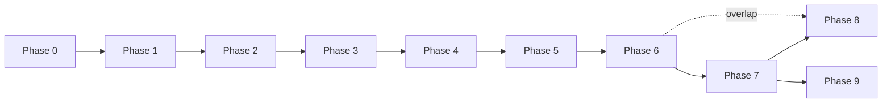

## 14. Implementation Roadmap

Each phase has a goal, concrete deliverables, and **acceptance criteria** — measurable conditions for phase completion.

### Phase 0 — Project Scaffolding
**Goal:** a compilable Rust workspace with the right structure and dependencies.

**Files created:**
- `Cargo.toml` (workspace), `rust-toolchain.toml`, `.gitignore`, `README.md`
- `mkm-core/Cargo.toml`, `mkm-core/src/lib.rs` (empty re-export stub)
- `mkm-sim/Cargo.toml`, `mkm-sim/src/lib.rs` (Bevy plugin skeleton)
- `mkm-viz/Cargo.toml`, `mkm-viz/src/lib.rs` (no-op plugin)
- `mkm-cli/Cargo.toml`, `mkm-cli/src/main.rs` (hello-world clap stub)
- `.github/workflows/ci.yml`

**Tasks:**
- [ ] Initialize git repository with `main` branch.
- [ ] Create workspace `Cargo.toml` listing all four member crates.
- [ ] Pin toolchain in `rust-toolchain.toml` (stable, latest).
- [ ] Add dependencies at workspace level: `bevy = "=0.14.2"`, `rand = "0.8"`, `rand_chacha = "0.3"`, `glam = "0.27"`, `serde = { version = "1", features = ["derive"] }`, `serde_json`, `toml`, `rmp-serde`, `smallvec`, `clap`, `parquet`, `arrow`. **Pin Bevy to an exact patch** (`=0.14.x`) — Bevy's 0.x minor releases break aggressively (ECS scheduling, plugin APIs, render graph). Unpinned `"0.14"` ranges silently pull in breaking changes; bump deliberately with a migration note in `CHANGELOG.md`.
- [ ] Configure `[profile.release]` with `lto = "thin"`, `codegen-units = 1`.
- [ ] Add CI workflow: matrix on `ubuntu-latest` running `cargo fmt --check`, `cargo clippy --all-targets -- -D warnings`, `cargo test --workspace`.
- [ ] Write `README.md`: prerequisites, `cargo run -p mkm-cli -- --help`, link to `docs/core.md`.
- [ ] Add `.editorconfig` and a minimal `rustfmt.toml`.

**Acceptance:**
- [ ] `cargo build --workspace` succeeds on a clean clone.
- [ ] `cargo test --workspace` passes (empty).
- [ ] CI green on initial commit.
- [ ] `mkm-cli --help` prints usage.
- [ ] `README.md` build/run instructions verified from a clean checkout.

---

### Phase 1 — Core Data Model & Tick Loop
**Goal:** spawn vertices with multi-layer state and step through time with no dynamics yet.

**Depends on:** Phase 0.

**Files created:**
- `mkm-core/src/{id,layer,state,vertex,edge,inbox,coupling,energy,lifecycle,ringbuffer,params,math,events,snapshot,invariants}.rs`
- `mkm-core/tests/serde_roundtrip.rs`, `mkm-core/tests/invariants_static.rs`
- `mkm-sim/src/{tick,rng,init,scenarios}.rs`
- `mkm-sim/src/systems/{ingest,output}.rs` (stubs for others)
- `mkm-sim/tests/determinism.rs`
- `mkm-cli/src/config.rs`, `mkm-cli/src/commands/run.rs`

**Tasks:**
- [ ] `mkm-core`: define every struct/enum in Section 3 with `#[derive(Clone, Debug, Serialize, Deserialize, PartialEq)]`.
- [ ] `layer.rs`: `enum LayerKind { Physical, Emotional, Economic, Social }`; `fn all() -> &'static [LayerKind; 4]`; `signal_extractor(layer, state) -> f32`.
- [ ] `ringbuffer.rs`: fixed-capacity ring buffer with const generic `N`; `push`, `iter`, `len`, `mean`, `sum_abs`.
- [ ] `params.rs`: `struct Params { ... }` with all Section 12 entries; `Default` impl with listed defaults; `from_toml(Path) -> Result<Params>`.
- [ ] `invariants.rs`: one function per invariant; `check_all(world, params) -> Vec<InvariantViolation>`.
- [ ] `events.rs`: `TensorImpact`, `EventTarget` (`Single | Region | Layer | Global`), `EventQueue` resource with stable-ordered push.
- [ ] `mkm-sim/tick.rs`: define `SystemSet`s for Stages 1–7; register in `FixedUpdate` with explicit `.chain()` ordering.
- [ ] `rng.rs`: `struct RngResource(ChaCha20Rng)`; `fork(label: &str) -> ChaCha20Rng` splits deterministically.
- [ ] `init.rs`: implement the three `init_distribution` modes from Section 3.B; seed from `Params.seed`.
- [ ] `systems/ingest.rs`: drain `EventQueue`, apply `TensorImpact` as `state += impact` clamped.
- [ ] `systems/output.rs`: emit per-tick summary (count, sim_time) to stdout; write snapshot at `snapshot_interval`.
- [ ] `mkm-cli/commands/run.rs`: load TOML → build Bevy app → run for `max_ticks` → exit.
- [ ] Add `cargo bench` smoke benchmark: full tick at 10K vertices with no dynamics.

**Acceptance:**
- [ ] 10 000 vertices spawned with randomized initial state matching Section 3.B.
- [ ] `sim_time` advances by exactly `dt` each tick (exact `f32` equality under fixed `dt = 1.0`).
- [ ] Snapshot round-trip preserves all state bit-for-bit (`assert_eq!(before, after)`).
- [ ] Same seed → identical SHA-256 hash of final snapshot across 3 back-to-back runs.
- [ ] Tick rate ≥ 1000/s at 10K vertices (no-dynamics baseline) on **reference CPU**.

> [!NOTE]
> **Reference hardware.** Throughput targets in this doc quote a **reference CPU** and **reference GPU**; the canonical baseline is recorded in `benches/hardware.toml` (currently: `cpu = "AMD Ryzen 7 5700X"`, `gpu = "AMD Radeon RX 7600"`). When benchmarks are run on different hardware, normalize results against the committed baseline rather than editing the acceptance numbers — targets remain meaningful across machines that way.
- [ ] All Invariants 1, 2, 3, 7 hold at every tick under an empty dynamics set.

---

### Phase 2 — Edge Mechanics (Pondered Edges)
**Goal:** edges filter and transform signals; history matters.

**Depends on:** Phase 1.

**Files created/modified:**
- `mkm-sim/src/systems/propagate.rs` (new)
- `mkm-sim/src/systems/history.rs` (new)
- `mkm-core/src/edge.rs` (expand: `conductance()`, `category()`, hysteresis helper)
- `mkm-sim/tests/propagate_numeric.rs` (new)
- `mkm-sim/tests/hysteresis.rs` (new)
- `mkm-sim/benches/edges_100k.rs` (new)

**Tasks:**
- [ ] `propagate.rs`: iterate edges, extract source signal via `layer::signal_extractor`, compute $s_\text{out} = w \cdot g \cdot s_\text{in} \cdot (m / (1 + m))$, push to target's `Inbox` layer bucket.
- [ ] `propagate.rs`: inbox buckets pre-sized; allocation-free fast path using `SmallVec` inline capacity 8.
- [ ] `history.rs`: append `|signal|` to each edge's `RingBuffer<f32; HISTORY_WINDOW>` at Stage 6.
- [ ] `history.rs`: compute `f(history) = ring.mean()`; apply `resistance_{t+1} = α · resistance_t + (1-α) · f(history)` with `α = α_resistance`.
- [ ] `edge.rs::category()`: return `Thick | Thin | Brittle` from `|weight|` × `resistance`; used for diagnostics only.
- [ ] Add `EdgeLifecycle::Strained` trigger: when `resistance > 0.7 · YIELD_POINT`.
- [ ] Integration test: two-vertex chain under constant signal; assert convergence.
- [ ] Integration test: alternating ± signal; assert asymmetric resistance growth vs. steady-state.
- [ ] Benchmark: 100K edges, single-threaded, measure ticks/sec.

**Acceptance:**
- [ ] Two-vertex constant-signal test: resistance converges to analytic value within 1% in ≤ HISTORY_WINDOW ticks.
- [ ] Alternating-signal test: hysteresis produces asymmetric resistance trajectory measurable at $10^{-3}$.
- [ ] 100K edges, single-threaded: ≥ 100 ticks/s on **reference CPU**.
- [ ] Invariants 1–4 hold across a 10K-tick fuzz run with random `TensorImpact` at 1% of ticks.
- [ ] Inbox is empty at start of every Stage 4 (verified via system ordering test).

---

### Phase 3 — Kinetic Cascades & Bridge Functions
**Goal:** cross-layer bleed-through via bridge functions. **The single most critical phase** — the quality of the whole model hinges on these equations.

**Depends on:** Phase 2.

**Files created/modified:**
- `mkm-sim/src/bridge_registry.rs` (new)
- `mkm-sim/src/systems/bridges.rs` (new)
- `mkm-core/src/energy.rs` (expand: `deduct()`, `regen()`, `can_afford()`)
- `mkm-sim/tests/bridges_numeric.rs` (new)
- `mkm-sim/tests/energy_bookkeeping.rs` (new)
- `mkm-sim/tests/mass_damping.rs` (new)

**Tasks:**
- [ ] `bridge_registry.rs`: define `trait BridgeFn: Send + Sync { fn apply(&self, view: &VertexView, params: &Params, amp: f32) -> LayerDelta; }`.
- [ ] `BridgeRegistry` stores `HashMap<(LayerKind, LayerKind), Box<dyn BridgeFn>>`; `default_set()` registers the eight from Section 6.
- [ ] `systems/bridges.rs`: for each vertex (parallel-safe), compute `agg_l = inbox[l].sum()`, apply intra-layer updates, then iterate registered bridges, sum per-layer deltas, apply `A * D(m)`, clamp, write back.
- [ ] Clear `Inbox` at end of Stage 3.
- [ ] Compute `bridge_activity = Σ|δ·A·D|` per vertex; pass to `energy.rs::deduct(BRIDGE_ACTIVITY_COST · bridge_activity)`.
- [ ] Per-layer clamping centralised in `state.rs::clamp_all()` for reuse.
- [ ] Unit test per bridge: hand-compute expected delta at fixed state, assert within `1e-6`.
- [ ] Integration test: emotional spike → proportional $M_p$, $M_c$ change within 3 ticks, values match analytic prediction within 5%.
- [ ] Integration test: set `coupling.level = 1.0` and identical state; verify output = `COUPLING_AMPLIFICATION × output_at_level_0`.
- [ ] Mass damping test: two vertices, identical state except `mass ∈ {1.0, 5.0}`; output ratio matches $D(1)/D(5)$.
- [ ] Custom scenario test: register a `B_ce` closure at runtime and verify it fires.

**Acceptance:**
- [ ] Emotional spike injection → proportional change in $M_p$ and $M_c$ within 3 ticks (analytic match within 5%).
- [ ] Tight coupling (`level = 1.0`) amplifies bridge outputs by exactly `COUPLING_AMPLIFICATION` at `mass = 1.0`.
- [ ] Energy bookkeeping (Invariant 5) holds per vertex per tick within $10^{-5}$ tolerance.
- [ ] Mass damping verified: `D(m)` matches formula within `1e-6` across $m \in [0.1, 10]$.
- [ ] Scenario config can register custom bridge functions without recompile (via dynamic dispatch).
- [ ] Invariants 1–5 hold across 10K-tick fuzz run with random shocks every 100 ticks.

---

### Phase 4 — Structural Plasticity
**Goal:** the mesh topology evolves.

**Depends on:** Phase 3.

**Files created/modified:**
- `mkm-sim/src/systems/plasticity.rs` (new)
- `mkm-sim/src/spatial/{quadtree,index}.rs` (new; octree stubbed)
- `mkm-sim/src/systems/output.rs` (expand: event-log JSONL writer)
- `mkm-sim/tests/plasticity.rs` (new)
- `mkm-sim/tests/zombie_reentry.rs` (new)

**Tasks:**
- [ ] `plasticity.rs`: Stage 5 order is **regen → Snap → Zombie-check → Weave → cost-deduct**.
- [ ] Snap trigger: `resistance > YIELD_POINT` OR (layer == Economic AND `signal_recent ≈ 0` for ≥ HISTORY_WINDOW/2 ticks).
- [ ] Before Snap, edges pass through `Strained` for at least 1 tick (elasticity).
- [ ] Zombie transition: vertex with 0 active edges for ≥ 1 tick → `LifecycleState::Zombie { decay_since: tick }`.
- [ ] Zombie per-tick decay: `state_l *= ZOMBIE_DECAY` applied to all scalar fields; position frozen.
- [ ] `spatial/quadtree.rs`: rebuild once per tick over active vertex positions; `query_radius(p, r) -> Vec<VertexId>`.
- [ ] Weave search: when vertex enters Tight Coupling with fewer than `MIN_EDGES` active edges, find candidates via quadtree (for $M_p$) or by scanning top-N by `trust` (for $M_s$).
- [ ] Weave cost: `BASE_COST × (PHYSICAL_MULTIPLIER if layer == Mp else 1.0)`. If `EnergyBudget.current < cost`, defer.
- [ ] Re-entry: a new edge to a Zombie restores `LifecycleState::Active` with already-decayed state retained.
- [ ] Event-log: append one JSON line per Snap / Weave / Zombie / Re-entry / Shatter to `snapshot_path/events.jsonl`.
- [ ] Test: seed one edge with `resistance = 0.95` → Strained → Snap within 2 ticks.
- [ ] Test: disconnect a vertex → Zombie in 1 tick → verify `ZOMBIE_DECAY` applied each tick.
- [ ] Test: new edge to Zombie → `Active` with post-decay state.
- [ ] Test: force `coupling.level = 1.0` in a cluster of 100 vertices → Weave event count > baseline by 3×.

**Acceptance:**
- [ ] Resistance past `YIELD_POINT` → Strained → Snap within 2 ticks.
- [ ] Isolated vertex → Zombie within 1 tick; scalar state decays by `ZOMBIE_DECAY` per tick.
- [ ] New edge to Zombie → reactivation with decayed state applied.
- [ ] Tight-coupling cluster shows ≥ 3× Weave events vs. loose-coupling baseline.
- [ ] Invariant 4 (no dangling edges) holds across 10K ticks of random perturbation with snap/bridge churn.
- [ ] Deferred events correctly retry when energy recovers (no starvation beyond 100 ticks).
- [ ] Event log parses cleanly (JSONL validator on output).

---

### Phase 5 — Crisis Metrics
**Goal:** quantitative stress diagnostics.

**Depends on:** Phase 4.

**Files created/modified:**
- `mkm-sim/src/systems/crisis.rs` (new)
- `mkm-sim/src/metrics.rs` (new)
- `mkm-sim/tests/shear.rs`, `mkm-sim/tests/collapse.rs`, `mkm-sim/tests/percolation.rs` (new)
- `mkm-core/src/coupling.rs` (expand: `update(stress, params)`)

**Tasks:**
- [ ] `crisis.rs::compute_shear(vertex)`: implement per-layer normalization to $[0,1]^n$; compute L2 pairwise distances; average over $\binom{4}{2} = 6$ pairs.
- [ ] Conditional calculation: track `max_layer_delta` per vertex; only recompute $S_\mu$ if above `TENSION_THRESHOLD`.
- [ ] `metrics.rs`: rolling-window `CollapseCounter<N=COLLAPSE_WINDOW>` per layer; `c_mu() = snapped_in_window / active_at_window_start`.
- [ ] LCC computation: union-find over each layer's edges at tick end; record largest-component fraction.
- [ ] Shatter detection: set `shatter_flag = true` for first tick where any layer's LCC fraction < `φ_c`; event-logged.
- [ ] `coupling::update`: apply the stress formula and EMA from Section 4; write to `CouplingState`.
- [ ] Integrate metric outputs into per-tick Parquet row.
- [ ] Test: create a vertex with hand-chosen per-layer state; verify $S_\mu$ matches hand computation to $10^{-4}$.
- [ ] Test: bulk-delete 50% of $M_s$ edges over 100 ticks; verify collapse flag fires when $C_\mu > $ threshold.
- [ ] Percolation test: delete edges uniformly at random in $M_p$; record the deletion fraction at which Shatter fires; average over 10 seeds; expect $\phi_c \approx 0.5 \pm 0.05$ (Erdős–Rényi tolerance).
- [ ] Feedback loop integration test: inject shock → shear grows → coupling rises → next-tick bridge outputs amplified.

**Acceptance:**
- [ ] Hand-computed $S_\mu$ matches implementation within $10^{-4}$ for 5 manual test cases.
- [ ] $C_\mu$ triggers collapse flag at threshold in synthetic edge-deletion test.
- [ ] Percolation: Shatter fires at $\phi_c = 0.5 \pm 0.05$ averaged across 10 seeds.
- [ ] Feedback loop demonstrable end-to-end on a 1000-tick shock scenario.
- [ ] Invariants 1–7 hold across all crisis-metric tests.

---

### Phase 6 — Performance & Scale
**Goal:** scale from $10^3$ to $10^5$–$10^6$ nodes.

**Depends on:** Phase 5 (functional sim needed to benchmark).

**Files created/modified:**
- `mkm-sim/src/systems/propagate.rs` (CSR storage; parallel iteration)
- `mkm-sim/src/systems/bridges.rs` (Rayon parallelism)
- `mkm-sim/src/spatial/octree.rs` (implement; per-vertex fallback)
- `mkm-sim/benches/{full_tick_100k,full_tick_1m}.rs` (new)
- `profiling/flamegraph.sh` (new helper)

**Tasks:**
- [ ] Convert edge storage to CSR: `row_ptr: Vec<u32>`, `col_idx: Vec<u32>`, `data: Vec<EdgePayload>`.
- [ ] Parallelize Stage 2 via Rayon per source-vertex row; target inbox writes use atomic-appending `Mutex<SmallVec>` or thread-local shards merged at end of stage.
- [ ] Parallelize Stage 3 per vertex (read-only inbox, write-only state — trivially parallel).
- [ ] Parallelism gate: `parallelism = "deterministic" | "parallel"` selects sequential reductions vs. Rayon.
- [ ] Activate octree per-vertex when $S_\mu > $ octree threshold (set to 3 × `TENSION_THRESHOLD`).
- [ ] Flamegraph profiling at $10^5$ nodes; document top 5 hotspots in `profiling/notes.md`.
- [ ] Add benchmarks at $10^3$, $10^4$, $10^5$ nodes to `mkm-sim/benches/`; commit baseline numbers to `benches/baseline.json`.

**Acceptance:**
- [ ] Baseline benchmarks at $10^3$, $10^4$, $10^5$ nodes committed.
- [ ] Tick rate ≥ 30/s at $10^5$ nodes on **reference CPU**, CPU-only, parallel mode.
- [ ] Memory footprint within budget (extrapolates to ~32GB at $10^6$ per Section 11).
- [ ] Deterministic mode matches single-threaded output bit-for-bit over 1000 ticks.
- [ ] Parallel mode matches deterministic mode within $10^{-4}$ per state variable at tick 1000.

---

### Phase 7 — GPU Acceleration
**Goal:** offload bulk parallel workloads to the **reference GPU**.

**Depends on:** Phase 6.

**Files created/modified:**
- `mkm-sim/src/gpu/{mod,shaders,buffers,dispatch}.rs` (new)
- `mkm-sim/src/shaders/{propagate.wgsl,bridges.wgsl}` (new)
- `mkm-sim/tests/gpu_parity.rs` (new)

**Tasks:**
- [ ] WGSL compute shader for Stage 2 (edge signal propagation) operating on CSR buffers.
- [ ] WGSL compute shader for intra-layer portion of Stage 3.
- [ ] CPU retains: structural plasticity, coupling update, crisis metrics (branch-heavy code stays on CPU).
- [ ] Double-buffered state upload: `state_gpu_in ↔ state_gpu_out`, swap each tick.
- [ ] Runtime toggle: `backend = "cpu" | "gpu"` in config.
- [ ] Parity test: seeded 1000-tick run, CPU vs. GPU; per-variable absolute diff < $10^{-4}$.

**Acceptance:**
- [ ] CPU-only vs. CPU+GPU output matches within $10^{-4}$ per state variable over 1000 ticks.
- [ ] ≥ 5× throughput improvement for edge-heavy workloads ($10^5$ nodes, $5 \times 10^6$ edges).
- [ ] $10^6$ nodes feasible at ≥ 10 ticks/s on **reference CPU + reference GPU**.
- [ ] VRAM usage stays within 8 GB at max scale (verified via `wgpu` query).

---

### Phase 8 — 3D Visualization
**Goal:** real-time rendering of mesh state.

**Depends on:** Phase 7 (for scale); can start in parallel with Phase 6 at small scale.

**Files created/modified:**
- `mkm-viz/src/lib.rs` (activate plugin)
- `mkm-viz/src/render/{vertices,edges,pillars}.rs`
- `mkm-viz/src/views/{top_down,profile}.rs`
- `mkm-viz/src/throttle.rs`, `mkm-viz/src/overlay.rs`
- `mkm-viz/tests/visual_regression.rs` (image-hash based)

**Tasks:**
- [ ] Layer Z-offsets: `Mp=0, Me=1, Mc=2, Ms=3` (unit Z spacing; configurable).
- [ ] Vertex primitives: instanced spheres; color by `LifecycleState`; size by `mass`.
- [ ] Edge primitives: instanced line segments; color via `resistance` gradient (green → yellow → red); pulse when `Strained`.
- [ ] Pillar primitive: vertical line segment between a vertex's four projections; color mapped to $S_\mu$.
- [ ] Camera modes: top-down (XY, with layer selector 1–4 or "all") and profile (XZ).
- [ ] LOD throttle: when a region's collapse rate > threshold, render as point cloud instead of mesh primitives.
- [ ] HUD overlay: mean/max shear, coupling level, LCC per layer, shatter flag.
- [ ] Visual regression: render canonical scenario frames → SHA-256 hash against golden images.

**Acceptance:**
- [ ] 60 FPS at $10^4$ nodes with full mesh rendering (measured over 60-second window).
- [ ] 30 FPS at $10^5$ nodes with throttling active.
- [ ] Visual regression tests: canonical scenarios produce deterministic renders (hash match or SSIM ≥ 0.99).
- [ ] Camera controls work in both top-down and profile modes; layer selector isolates the expected layer.

---

### Phase 9 — Scenarios & Predictive Engineering
**Goal:** the simulation becomes a tool, not just a model.

**Depends on:** all prior phases.

**Files created/modified:**
- `mkm-sim/src/scenarios.rs` (expand: 4 presets)
- `mkm-cli/src/commands/{scenario,sweep,inspect,replay}.rs`
- `mkm-cli/src/export/{parquet,jsonl,msgpack}.rs`
- `analysis/` directory with Python notebooks for heatmap generation
- `docs/scenarios.md` (scenario walkthrough)

**Tasks:**
- [ ] Implement four scenario presets per Section 8: Economic Shock, Social Fragmentation, Crisis Escalation, Mutual Aid Formation.
- [ ] Each preset is a function `fn(Params) -> (InitialConditions, EventSequence)` registered in `scenarios.rs`.
- [ ] `sweep` command: parse `--param <name> --range <lo>..<hi>:<step> [--seeds <N>]`; for each parameter point, run $N$ simulations (distinct seeds derived from the base seed); write one row per `(param_value, seed)` to a single Parquet file; emit summary rows with median + IQR per `param_value`.
- [ ] Binary-search helper (`scenarios::find_minimum`): input = scenario, search axis, $(\theta_{\text{recovery}}, T_{\text{recovery}}, p, N)$; output = $\text{MM}(S, x)$ per Section 8, with the ensemble's median-of-boundary and IQR returned as a confidence band.
- [ ] Parquet export: per-tick metrics row matching Section 13 schema.
- [ ] JSONL export: per-event rows; sorted by tick.
- [ ] MessagePack snapshot: full mesh state; verified load round-trip.
- [ ] `replay` command: load MessagePack → reconstruct Bevy world → resume simulation from that tick.
- [ ] `inspect` command: load snapshot → print summary stats + run invariant checks.
- [ ] Python analysis scripts: load Parquet via `polars`, plot resilience heatmap, verify known-result reproductions.

**Acceptance:**
- [ ] All four scenario presets run end-to-end and produce expected qualitative outcomes documented in `docs/scenarios.md`.
- [ ] Parameter sweep reproduces at least one known-result resilience boundary (e.g., Shatter at $\phi_c = 0.5$ via `edge_density` sweep) with $N \geq 32$ seeds per point; boundary IQR reported.
- [ ] `find_minimum` on one scenario produces an MM with boundary IQR ≤ 20% of median (stable MM) — if unstable, the failure is reported, not hidden.
- [ ] Data exports load cleanly in `polars` without manual fixup.
- [ ] `mkm-cli inspect` reports invariant violations on a purposely-corrupted snapshot.
- [ ] `mkm-cli replay` produces bit-identical continuation vs. the original run.
- [ ] Documented workflow end-to-end: `config → run → analysis → report`.

---

> [!NOTE]
> **Phase Dependencies.** Phases 0–5 are strictly sequential. Phase 6 (perf) and Phase 8 (viz) can overlap. Phase 7 (GPU) feeds both Phase 8 and Phase 9.

---

