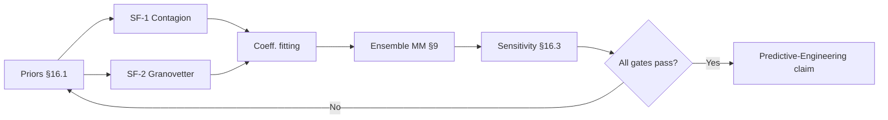

## 15. Testing & Verification Strategy

Five test tiers, each with a home in the repo and a trigger in CI.

### Tier 1 — Unit Tests (`cargo test -p <crate>`)
* **Scope:** single functions, pure math, type conversions.
* **Location:** `src/**/*.rs` inline `#[cfg(test)]` blocks.
* **Examples:** `conductance(r)`, `sigmoid(x)`, `clamp_state(s)`, each bridge function's `apply()`.
* **Runs on:** every PR.

### Tier 2 — Integration Tests (`cargo test --test <name>`)
* **Scope:** multi-system interactions within one tick or over few ticks.
* **Location:** `<crate>/tests/*.rs`.
* **Required suite (by phase):**
    * Phase 1: `serde_roundtrip`, `invariants_static`, `determinism`.
    * Phase 2: `propagate_numeric`, `hysteresis`.
    * Phase 3: `bridges_numeric`, `energy_bookkeeping`, `mass_damping`.
    * Phase 4: `plasticity`, `zombie_reentry`.
    * Phase 5: `shear`, `collapse`, `percolation`.
    * Phase 7: `gpu_parity`.
* **Runs on:** every PR.

### Tier 3 — Property Tests (`proptest`)
* **Scope:** invariants hold under randomized inputs.
* **Location:** `<crate>/tests/prop_*.rs`.
* **Targets:** state clamping (Invariant 1), edge directionality (Invariant 2), layer isolation (Invariant 3), mass monotonicity (Invariant 6).
* **Harness:** 1000 random inputs per property, shrinking enabled.
* **Runs on:** every PR.

### Tier 4 — Scenario / Regression Tests
* **Scope:** full simulations at fixed seed; assert qualitative outcomes.
* **Location:** `mkm-sim/tests/scenarios/*.rs`.
* **Method:** run for N ticks, compare key metrics (mean shear, LCC, coupling trajectory) against pinned tolerances in `golden/*.json`.
* **Runs on:** every PR; updates to `golden/` require review.

### Tier 5 — Benchmarks (`cargo bench`)
* **Scope:** throughput, memory, scaling.
* **Location:** `mkm-sim/benches/*.rs`.
* **Targets:** `edges_10k`, `edges_100k`, `full_tick_100k`, `full_tick_1m`.
* **Baseline:** tracked in `benches/baseline.json`; CI fails on > 10% regression.
* **Runs on:** nightly and manual dispatch.

### Determinism Contract
* All RNG derives from the single seed via `rng::fork(label)` — each system gets a named, reproducible stream.
* Determinism test: run 3× at same seed, assert SHA-256 of tick-1000 snapshot is identical.
* Parallel-mode parity: `parallelism = "parallel"` output matches `"deterministic"` mode within $10^{-4}$ per variable at tick 1000.

### Invariant Enforcement
* `check_all()` runs at the end of every tick in debug builds (panics on violation).
* In release builds, violations emit structured warnings; count is an exported metric.
* The `inspect` CLI command runs invariant checks offline against any snapshot.

---

## 16. Calibration & Validation

> [!IMPORTANT]
> **Bridge Functions are the model** (see §18). Choosing their coefficients is therefore the central empirical act of the project. Any **Predictive Engineering** claim about a **Mathematical Minimum** (§6, §9) is conditional on calibration — an uncalibrated model can run, but its numbers mean nothing beyond internal consistency.

### 16.1 Sign & Magnitude Priors

Before any $K_{xy}$ coefficient is fitted, its **sign** and **rough magnitude** must be consistent with established findings in the relevant literature. These are hard priors — violating them indicates a bug in the bridge, not a novel prediction.

| Coefficient | Sign | Rough magnitude | Source of prior |
|---|---|---|---|
| $K_{EP}$ (emotion → physical) | + | small ($10^{-2}$–$10^{-1}$) | Affect-driven mobility: arousal increases motion, valence biases direction. |
| $K_{EC}$ (emotion → economic) | $\pm$ by valence | small | Behavioural economics: negative affect contracts consumption, positive expands it. |
| $K_{PC}$ (physical → economic) | + | moderate ($10^{-1}$) | Proximity drives transaction volume (gravity models in trade). |
| $K_{SE}$ (social → emotion) | + | moderate | Emotional contagion (Hatfield, Christakis & Fowler): trust inflow damps anxiety. |
| $K_{SC}$ (social → economic) | + | moderate | Social-capital literature: trust lowers transaction cost. |
| $K_{PE}$ (physical → emotion) | + (crowding → arousal) | small | Crowding/stress research; sign should flip in sparse regions if modeled. |
| $K_{CE}$ (economic → emotion) | + (throughput → valence) | moderate | Consumption smoothing / loss-aversion asymmetry — losses weigh ~2× gains. |
| $K_{CS}$ (economic → social) | + (throughput → trust) | moderate | Reciprocity studies: successful exchange builds trust, failed exchange erodes it faster (asymmetry to encode). |

**Asymmetry priors.** Loss hurts more than equivalent gain helps. Bridges with valence-sensitive terms ($K_{EC}$, $K_{CE}$, $K_{CS}$) should encode a factor ~2 between the negative and positive branches, not a symmetric response.

**Derivation rule.** Every coefficient in `config.toml` must have an associated comment citing (1) its sign prior and (2) the phenomenon that fixes its order of magnitude. A coefficient without a citation is a failed review.

### 16.2 Falsification via Stylized Facts

The model must reproduce **at least two** canonical stylized facts from outside the Predictive-Engineering target domain before any Predictive-Engineering claim is published. Failure on any of these is a blocker, not a calibration nuisance — it indicates the bridge specification is wrong, not its coefficients.

**SF-1: Financial-contagion cascade (Gai–Kapadia style).**
* Setup: a connected $M_c$ subgraph with heterogeneous throughput; initial shock removes ~1% of vertices' economic state.
* Expected: a phase transition in cascade size as average $M_c$ degree increases — small average losses at low connectivity, large (20–80% of component) losses in a critical band, small losses again at very high connectivity (diversification).
* Acceptance: cascade-size curve vs. degree shows non-monotone "robust-yet-fragile" shape with a peak in the critical band.

**SF-2: Granovetter threshold dynamics.**
* Setup: $M_s$ subgraph where each vertex has a heterogeneous activation threshold $\tau_i \sim \mathcal{N}(\mu, \sigma)$; a single seed vertex flips active.
* Expected: total activation is highly sensitive to $\sigma$ near $\mu = 0.25$ — tiny threshold-variance changes flip between ~0% and near-total adoption. This is a distributional, not an average-value, phenomenon.
* Acceptance: sweeping $\sigma$ at fixed $\mu$ shows a discontinuous adoption curve with $\geq 50$ percentage-point jump across a narrow $\sigma$ band.

**SF-3 (optional, stretch): loss-aversion asymmetry in $M_e$ under paired shocks.**
* Setup: identical-magnitude positive and negative economic shocks to matched vertex cohorts.
* Expected: negative-shock cohort shows ~2× the valence excursion magnitude and ~2× the decay time of the positive-shock cohort.
* Acceptance: ratio of response integrals $\geq 1.7$, $\leq 2.3$.

Each stylized-fact reproduction ships as a scenario file in `scenarios/calibration/` and as an acceptance test. Phase 7 onward cannot be considered calibrated until SF-1 and SF-2 pass in ensemble ($N \geq 32$ seeds).

### 16.3 Sensitivity Analysis

Before any Mathematical-Minimum number is reported, run a **global sensitivity analysis** on every $K_{xy}$ coefficient that enters the computed MM. This is the gate between "simulation output" and "Predictive-Engineering claim".

**Protocol:**
1. Identify the MM(S, x) value and its 95% ensemble CI for the nominal parameter point.
2. For each calibration coefficient $K$, vary it by $\pm 25\%$ holding all others fixed; re-run the MM ensemble.
3. Compute elasticity $\eta_K := \partial \log \text{MM} / \partial \log K$, estimated by finite difference.
4. Flag any $|\eta_K| > 1$ as **load-bearing** — the MM claim is then conditional on that coefficient being correct, and its prior citation (§16.1) must survive external review.
5. Additionally, run a Sobol or Morris global sensitivity (cross-parameter interactions) for the top-5 load-bearing coefficients. Interaction terms matter more than main effects when bridges are composed by sum (§17.2).

**Acceptance rule.** A Mathematical-Minimum result is **publishable** only if:
* Ensemble IQR $\leq 20\%$ of median (per §9).
* SF-1 and SF-2 pass at the same parameter point.
* No single $K_{xy}$ coefficient has $|\eta_K| > 2$.
* Top-5 load-bearing coefficients have explicit source citations in `config.toml`.

Results not meeting all four gates may be reported internally, but not as Predictive-Engineering claims.

### 16.4 Model-Validation Sequence

Calibration is an ordered pipeline — do not skip steps.

The loop from "No" back to §16.1 is the honest case: calibration failure usually means a bridge's functional form — not its gains — is wrong.

---

